**Tecnológico​ ​Nacional​ ​de​ ​México Instituto Tecnológico de Tijuana**

***Departamento de Sistemas y Computación - Ingeniería en Sistemas Computacionales***

Sistemas Programables

  > Rene Solis Reyes

Abner Ramírez Castañeda

  > No. de control: 20211828

# Indice de practicas

[Practica 2.1 Hola Mundo y la Hora de Internet (NTP Time server)](#Hola-mundo)

[2.2  Desplegar temperatura en OLED Display con bitArray imagen](#Temperatura)

[2.3 Elabore un menú en OLED Display (MENU DE NAVEGACION) y Tipos de letra personalizadas FONTS](#Menu)


[2.5 Embeded Web Server PicoW (prender / pagar el BLINK led integrado por WEB)](#Web-Server)

[2.6 Bluetooth + LED (blink) via App (o Flask u otro medios)  móvil /laptop](#Bluetooth)

# Hola mundo
<center>
  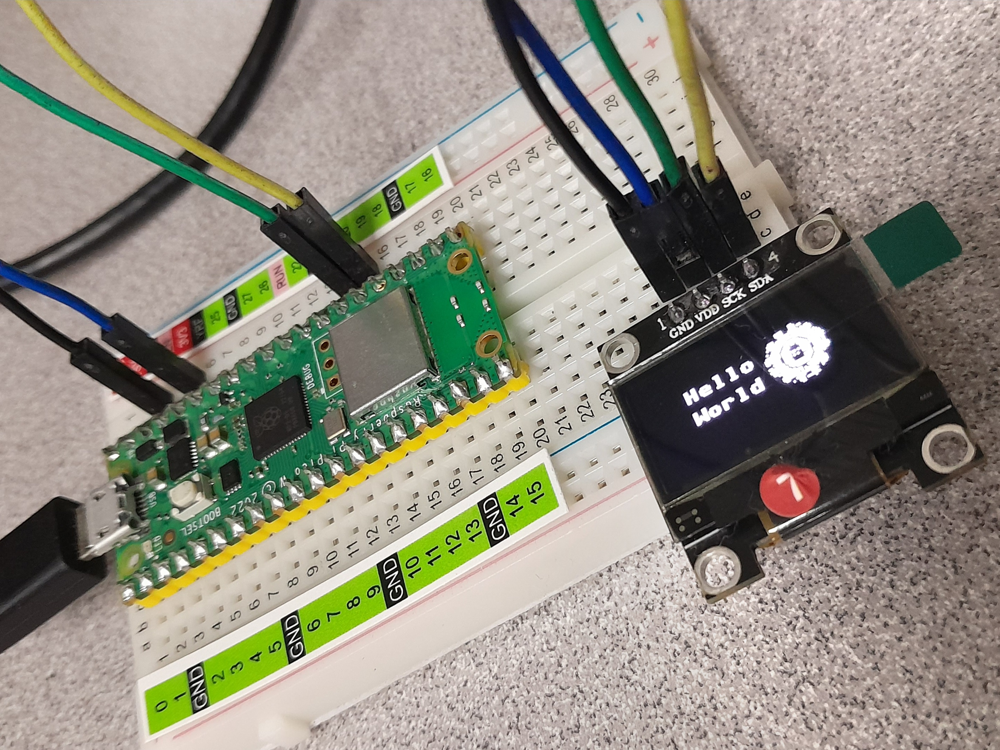
</center>

```python
from machine import Pin, I2C
from ssd1306 import SSD1306_I2C
import framebuf

pix_res_x = 128
pix_res_y = 64


def display_logo(oled):
    buffer = bytearray([
        0x00, 0x00, 0x30, 0x00, 0x00, 0x3c, 0x38, 0x00, 0x00, 0x3c, 0x3b, 0x00, 0x00, 0x1c, 0x78, 0x00, 
0x07, 0x1f, 0xfd, 0x60, 0x0f, 0x7b, 0x3f, 0xf0, 0x0f, 0xff, 0xef, 0xf0, 0x17, 0xfc, 0x3b, 0xe0, 
0x03, 0xe3, 0xc7, 0xe8, 0x27, 0x4f, 0xf3, 0xf4, 0x0f, 0x9d, 0xb9, 0xb6, 0x7f, 0x3c, 0x3c, 0xbe, 
0xff, 0x78, 0x1e, 0xff, 0xff, 0x78, 0x1e, 0xfe, 0xda, 0x7b, 0x5e, 0x52, 0x0e, 0x78, 0x1e, 0x7a, 
0x1e, 0x7a, 0x9e, 0x7a, 0xce, 0x70, 0x06, 0x7e, 0x7f, 0x78, 0x1e, 0xff, 0xff, 0x38, 0x1e, 0xff, 
0x7f, 0xbf, 0xfc, 0xfe, 0x67, 0x9d, 0xb9, 0xe8, 0x1f, 0xc7, 0xf3, 0xe0, 0x07, 0xf0, 0x0f, 0xe0, 
0x07, 0xfe, 0x3f, 0xf0, 0x0f, 0xfa, 0x9f, 0xf0, 0x0f, 0xfa, 0xfe, 0xf0, 0x06, 0x1f, 0xf8, 0xe0, 
0x00, 0x3e, 0x3c, 0x80, 0x00, 0x9c, 0x38, 0x00, 0x00, 0x1d, 0xfc, 0x00, 0x00, 0x0c, 0x10, 0x00
    ])
    fb = framebuf.FrameBuffer(buffer, 32, 32, framebuf.MONO_HLSB)
    
    oled.fill(0)
    oled.blit(fb, 70, 15)
    oled.show()

def display_text(oled):
    oled.text("Hello", 25, 20)
    oled.text("World", 25, 33)
    oled.show()

def main():
    i2c = I2C(0, scl=Pin(21), sda=Pin(20), freq=200000)
    oled = SSD1306_I2C(pix_res_x, pix_res_y, i2c)
    display_logo(oled)
    display_text(oled)

if __name__ == '__main__':
    main()
```

# Hora Tijuana
<center>
  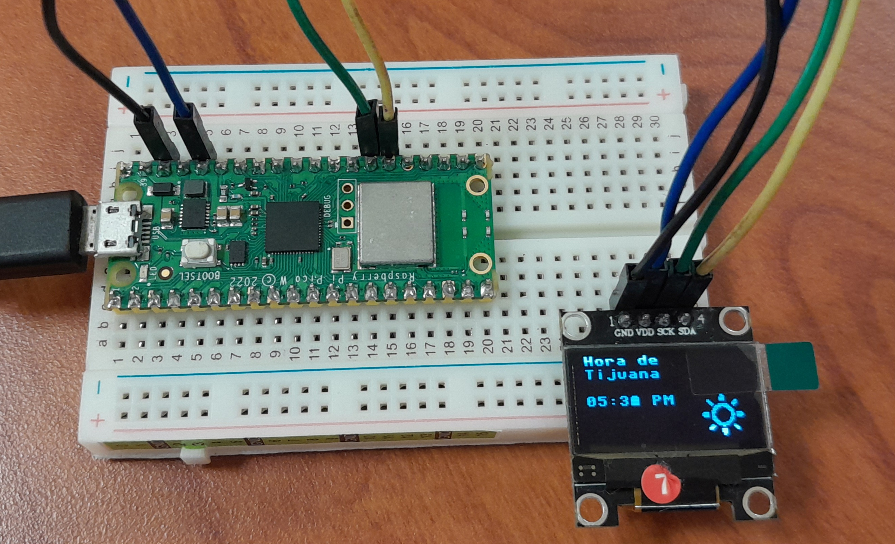
</center>

```python
import time
import framebuf
import time_images
import internet
from machine import I2C, Pin
from ssd1306 import SSD1306_I2C

pix_res_x = 128
pix_res_y = 64


def display_text(oled):
    oled.text("Hora de", 5, 0)
    oled.text("Tijuana", 5, 10)


def time_format(hour, minutes):
    f_hour = hour % 12 if hour != 12 else hour
    f_hour = ("0" + str(f_hour)) if f_hour < 10 else f_hour
    f_minutes = ("0" + str(minutes)) if minutes < 10 else minutes
    meridiem = "AM" if hour < 12 else "PM"
    return f"{f_hour}:{f_minutes} {meridiem}"


def match_image_time(hour):
    if 6 <= hour < 12:
        image = time_images.imgDia
    elif 12 <= hour < 18:
        image = time_images.imgTarde
    elif (18 <= hour <= 24) or (0 <= hour < 6):
        image = time_images.imgNoche
    else:
        raise ValueError("No disponible")
    return framebuf.FrameBuffer(image, 30, 30, framebuf.MONO_HLSB)


def display_time(oled, DEBUG=False):
    last_hour = -1
    last_image = bytearray()
    x_center = (pix_res_x + 50) // 2
    text_cover = 5, 20, oled.width - 5, 8, 0

    while True:
        localtime = time.localtime()
        hour, minutes = localtime[3:5]
        oled.fill_rect(*text_cover)
        oled.text(time_format(hour, minutes), 5, 30)

        if hour != last_hour:
            image = match_image_time(hour)
            last_hour = hour
            if image != last_image:
                oled.blit(image, x_center, 30)
                last_image = image

        oled.show()
        if DEBUG:
            print("Tiempo local:", localtime)
        time.sleep(1)


def main():
    i2c = I2C(0, scl=Pin(21), sda=Pin(20), freq=200000)
    oled = SSD1306_I2C(pix_res_x, pix_res_y, i2c)
   
    display_text(oled)
    display_time(oled)


if __name__ == "__main__":
    main()
```

```python
imgDia = bytearray(
    [
        0x00, 0x00, 0x00, 0x00, 0x00, 0x00, 0x00, 0x00, 0x00, 0x00, 0x00, 0x00, 0x00, 0x00, 0x00, 0x00,
0x00, 0x00, 0x00, 0x00, 0x00, 0x03, 0x00, 0x00, 0x00, 0x03, 0x00, 0x00, 0x06, 0x23, 0x11, 0x80,
0x06, 0x33, 0x31, 0x80, 0x07, 0x33, 0x33, 0x80, 0x03, 0x13, 0x23, 0x00, 0x13, 0x90, 0x27, 0x20,
0x39, 0x0f, 0xc2, 0x70, 0x1c, 0x3f, 0xf0, 0xe0, 0x0c, 0xf8, 0x7c, 0xc0, 0xc1, 0xc0, 0x0e, 0x0c,
0xf3, 0x80, 0x07, 0x3c, 0x37, 0x00, 0x03, 0xb0, 0x0e, 0x00, 0x01, 0xc0, 0x0c, 0x00, 0x00, 0xc0,
0x0c, 0x00, 0x00, 0xc0, 0x1c, 0x00, 0x00, 0xe0, 0x18, 0x00, 0x00, 0x60, 0xff, 0xff, 0xff, 0xfc,
0xff, 0xff, 0xff, 0xfc, 0x00, 0x00, 0x00, 0x00, 0x00, 0x00, 0x00, 0x00, 0x00, 0x00, 0x00, 0x00,
0x00, 0x00, 0x00, 0x00, 0x00, 0x00, 0x00, 0x00
    ]
)

imgTarde = bytearray(
    [
        0x00, 0x03, 0x00, 0x00, 0x00, 0x03, 0x80, 0x00, 0x00, 0x07, 0x80, 0x00, 0x00, 0x07, 0x80, 0x00,
0x0c, 0x07, 0x80, 0xc0, 0x0e, 0x00, 0x01, 0xc0, 0x07, 0x00, 0x03, 0xc0, 0x03, 0x8f, 0xe3, 0x80,
0x01, 0x3f, 0xf1, 0x00, 0x00, 0x7c, 0xf8, 0x00, 0x00, 0xf0, 0x3c, 0x00, 0x00, 0xe0, 0x1e, 0x00,
0x01, 0xc0, 0x0e, 0x00, 0x79, 0xc0, 0x06, 0x78, 0xf9, 0x80, 0x07, 0x7c, 0xf9, 0x80, 0x07, 0x7c,
0x79, 0xc0, 0x06, 0x78, 0x01, 0xc0, 0x0e, 0x00, 0x01, 0xe0, 0x0e, 0x00, 0x00, 0xf0, 0x1c, 0x00,
0x00, 0x78, 0x78, 0x00, 0x00, 0x3f, 0xf0, 0x00, 0x03, 0x1f, 0xe3, 0x00, 0x07, 0x83, 0x03, 0x80,
0x0f, 0x00, 0x01, 0xc0, 0x0e, 0x07, 0x80, 0xc0, 0x00, 0x07, 0x80, 0x00, 0x00, 0x07, 0x80, 0x00,
0x00, 0x03, 0x80, 0x00, 0x00, 0x03, 0x00, 0x00
    ]
)

imgNoche = bytearray(
    [
         0x00, 0x00, 0x00, 0x00, 0x00, 0x3c, 0x00, 0x00, 0x00, 0xfc, 0x00, 0x00, 0x03, 0xf8, 0x18, 0x00,
0x07, 0xf0, 0x18, 0x00, 0x0f, 0x70, 0x3c, 0x00, 0x1e, 0x60, 0x7f, 0x00, 0x3c, 0xe0, 0xff, 0x00,
0x38, 0xe0, 0x3e, 0x00, 0x70, 0xc0, 0x18, 0x00, 0x70, 0xc0, 0x18, 0x00, 0xe0, 0xc0, 0x00, 0x40,
0xe0, 0xc0, 0x00, 0x60, 0xe0, 0xc0, 0x00, 0xe0, 0xc0, 0xe0, 0x01, 0xf8, 0xc0, 0xe0, 0x03, 0xfc,
0xc0, 0xe0, 0x01, 0xf0, 0xe0, 0x60, 0x00, 0xe0, 0xe0, 0x70, 0x00, 0x60, 0xe0, 0x38, 0x00, 0x00,
0x70, 0x1c, 0x00, 0x00, 0x70, 0x1e, 0x00, 0x00, 0x38, 0x0f, 0x80, 0x00, 0x3c, 0x03, 0xe0, 0x00,
0x1e, 0x01, 0xff, 0x80, 0x0f, 0x00, 0x7f, 0x80, 0x07, 0xc0, 0x0f, 0x00, 0x03, 0xf8, 0xfe, 0x00,
0x00, 0xff, 0xf8, 0x00, 0x00, 0x3f, 0xe0, 0x00
    ]
)
```

# Temperatura
<center>
  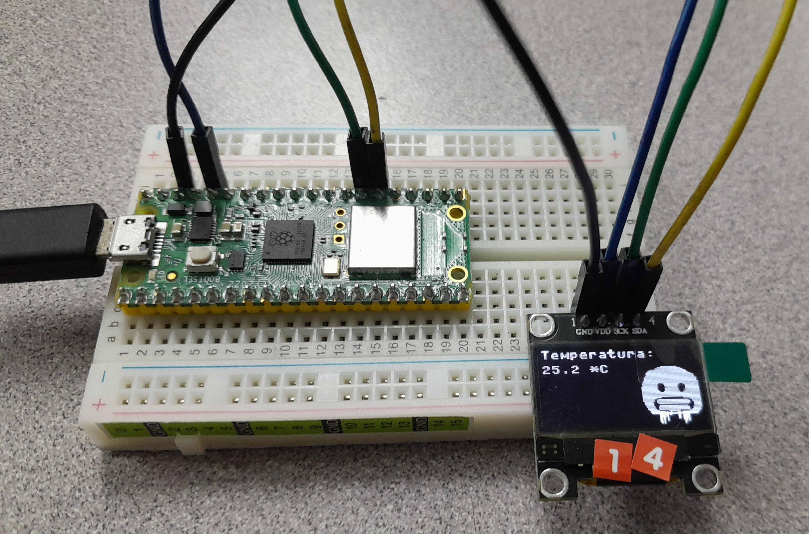
  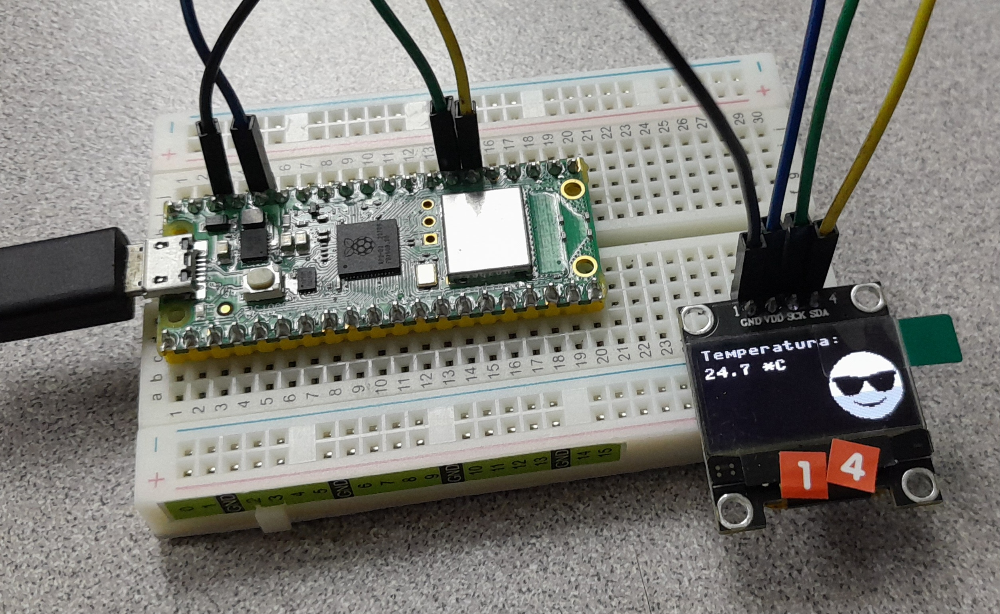
  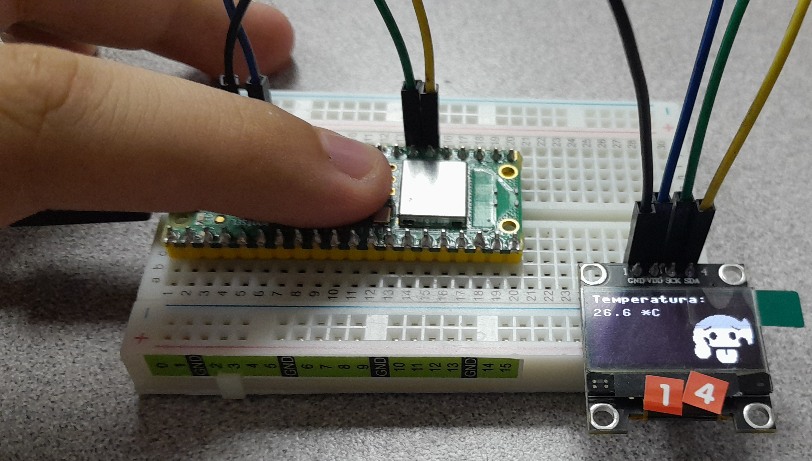
</center>

```python
# Hecho por Abner Ramirez Castaneda
#     con un numero de control de 20211828.
# Carrera de Ing. Sistemas Computacionales.
# Sistemas Programables B por Rene Solis Reyes.

# Importe de librerias para la funcion del programa.
import framebuf
from utime import sleep
from machine import Pin, I2C, ADC
from ssd1306 import SSD1306_I2C

# Variables declaradas y con valores asignado.
pix_res_x = 128
pix_res_y = 64

limite_BajoMedio = 20
limite_MedioAlto = 40

tempSensor = ADC(4)
factorConv = 3.3 / (65535)

miTemp = 0

# Arreglos de bytes con las 3 imagenes.
bytesFrio = bytearray([
        0x00, 0x00, 0x1f, 0xff, 0x00, 0x00, 0x00, 0x00, 0x00, 0xff, 0xff, 0xe0, 0x00, 0x00, 0x00, 0x03, 
0xff, 0xff, 0xf8, 0x00, 0x00, 0x00, 0x2f, 0xff, 0xff, 0xfe, 0x00, 0x00, 0x00, 0xff, 0xff, 0xff, 
0xff, 0x00, 0x00, 0x01, 0xff, 0xff, 0xff, 0xff, 0x80, 0x00, 0x03, 0xff, 0xff, 0xff, 0xff, 0xe0, 
0x00, 0x03, 0xff, 0xff, 0xff, 0xff, 0xf8, 0x00, 0x03, 0xff, 0xff, 0xff, 0xff, 0xf8, 0x00, 0x07, 
0xff, 0xff, 0xff, 0xff, 0xfc, 0x00, 0x0f, 0xff, 0xff, 0xff, 0xff, 0xfe, 0x00, 0x0f, 0xff, 0xff, 
0xff, 0xff, 0xfe, 0x00, 0x0f, 0xff, 0xff, 0xff, 0xff, 0xfe, 0x00, 0x1f, 0xff, 0xff, 0xff, 0xff, 
0xff, 0x00, 0x1f, 0xff, 0xff, 0xff, 0xff, 0xff, 0x00, 0x3f, 0xfe, 0x1f, 0xff, 0x0f, 0xff, 0x80, 
0x3f, 0xfc, 0x0f, 0xfe, 0x07, 0xff, 0x80, 0x3f, 0xfc, 0x0f, 0xfe, 0x07, 0xff, 0x80, 0x7f, 0xfc, 
0x07, 0xfc, 0x07, 0xff, 0xc0, 0x7f, 0xfc, 0x0f, 0xfe, 0x07, 0xff, 0xc0, 0x7f, 0xfc, 0x0f, 0xfe, 
0x07, 0xff, 0xc0, 0x7f, 0xfe, 0x0f, 0xfe, 0x0f, 0xff, 0xc0, 0x7f, 0xff, 0x1f, 0xff, 0x1f, 0xff, 
0xc0, 0x7f, 0xff, 0xff, 0xff, 0xff, 0xff, 0xc0, 0x7f, 0xff, 0xff, 0xff, 0xff, 0xff, 0xc0, 0x7f, 
0xff, 0xff, 0xff, 0xff, 0xff, 0xc0, 0x7f, 0xff, 0xff, 0xff, 0xff, 0xff, 0xc0, 0x7f, 0xff, 0x00, 
0x00, 0x3f, 0xff, 0xc0, 0x7f, 0xf0, 0x00, 0x00, 0x01, 0xff, 0xc0, 0x7f, 0xc7, 0xff, 0xff, 0xfc, 
0x7f, 0xc0, 0x7f, 0xcf, 0xff, 0xff, 0xfe, 0x7f, 0xc0, 0x3f, 0x8f, 0xff, 0xff, 0xfe, 0x3f, 0x80, 
0x3f, 0x87, 0xff, 0xff, 0xfc, 0x3f, 0x80, 0x3f, 0x80, 0x00, 0x00, 0x00, 0x3f, 0x80, 0x1f, 0x83, 
0xff, 0xff, 0xf8, 0x3f, 0x00, 0x1f, 0xc7, 0xff, 0xff, 0xfc, 0x7f, 0x00, 0x0f, 0xc7, 0xff, 0xff, 
0xfc, 0x7e, 0x00, 0x0f, 0xe7, 0xff, 0xff, 0xfc, 0xfe, 0x00, 0x07, 0xf8, 0x07, 0xfc, 0x03, 0xfc, 
0x00, 0x03, 0xff, 0xd2, 0x0c, 0xff, 0xf8, 0x00, 0x01, 0xff, 0xff, 0xff, 0xff, 0xf0, 0x00, 0x00, 
0x07, 0xf6, 0x0c, 0xf8, 0x00, 0x00, 0x00, 0x07, 0xd0, 0x0c, 0xf8, 0x00, 0x00, 0x00, 0x07, 0xd0, 
0x0c, 0xf8, 0x00, 0x00, 0x00, 0x06, 0x90, 0x0c, 0xf8, 0x00, 0x00, 0x00, 0x06, 0x90, 0x00, 0xe8, 
0x00, 0x00, 0x00, 0x06, 0x90, 0x00, 0x68, 0x00, 0x00, 0x00, 0x06, 0x80, 0x00, 0x40, 0x00, 0x00, 
0x00, 0x02, 0x80, 0x00, 0x40, 0x00, 0x00, 0x00, 0x00, 0x00, 0x00, 0x40, 0x00, 0x00
    ])
    
bytesTibio = bytearray([
        0x00, 0x00, 0x0f, 0xfc, 0x00, 0x00, 0x00, 0x00, 0x00, 0x7f, 0xff, 0x80, 0x00, 0x00, 0x00, 0x03, 
0xff, 0xff, 0xe0, 0x00, 0x00, 0x00, 0x07, 0xff, 0xff, 0xf8, 0x00, 0x00, 0x00, 0x1f, 0xff, 0xff, 
0xfe, 0x00, 0x00, 0x00, 0x3f, 0xff, 0xff, 0xff, 0x00, 0x00, 0x00, 0x7f, 0xff, 0xff, 0xff, 0x80, 
0x00, 0x01, 0xff, 0xff, 0xff, 0xff, 0xc0, 0x00, 0x01, 0xff, 0xff, 0xff, 0xff, 0xe0, 0x00, 0x03, 
0xff, 0xff, 0xff, 0xff, 0xf0, 0x00, 0x07, 0xff, 0xff, 0xff, 0xff, 0xf8, 0x00, 0x0f, 0xff, 0xff, 
0xff, 0xff, 0xf8, 0x00, 0x0f, 0xff, 0xff, 0xff, 0xff, 0xfc, 0x00, 0x1f, 0xff, 0xff, 0xff, 0xff, 
0xfc, 0x00, 0x1f, 0xff, 0xff, 0xff, 0xff, 0xfe, 0x00, 0x10, 0x00, 0xff, 0xff, 0xc0, 0x02, 0x00, 
0x20, 0x00, 0x07, 0xf8, 0x00, 0x01, 0x00, 0x20, 0x00, 0x00, 0x00, 0x00, 0x01, 0x00, 0x20, 0x00, 
0x00, 0x00, 0x00, 0x01, 0x00, 0x78, 0x00, 0x00, 0x00, 0x00, 0x07, 0x00, 0x78, 0x00, 0x00, 0x00, 
0x00, 0x07, 0x80, 0x78, 0x00, 0x00, 0xc0, 0x00, 0x07, 0x80, 0x78, 0x00, 0x00, 0xc0, 0x00, 0x07, 
0x80, 0x7c, 0x00, 0x01, 0xe0, 0x00, 0x0f, 0x80, 0x7c, 0x00, 0x01, 0xe0, 0x00, 0x0f, 0x80, 0x7e, 
0x00, 0x03, 0xf0, 0x00, 0x1f, 0x80, 0x7e, 0x00, 0x07, 0xf8, 0x00, 0x1f, 0x80, 0x7f, 0x00, 0x0f, 
0xfc, 0x00, 0x3f, 0x80, 0x3f, 0x80, 0x1f, 0xfe, 0x00, 0x7f, 0x00, 0x3f, 0xf5, 0xff, 0xff, 0xe7, 
0xff, 0x00, 0x3f, 0xff, 0xff, 0xff, 0xff, 0xff, 0x00, 0x1f, 0xff, 0xff, 0xff, 0xff, 0xfe, 0x00, 
0x1f, 0xff, 0xff, 0xff, 0xff, 0xfe, 0x00, 0x0f, 0xfd, 0xff, 0xff, 0xef, 0xfc, 0x00, 0x0f, 0xfc, 
0x7f, 0xff, 0x8f, 0xfc, 0x00, 0x07, 0xff, 0x1f, 0xfe, 0x3f, 0xf8, 0x00, 0x03, 0xff, 0x80, 0x00, 
0x7f, 0xf0, 0x00, 0x03, 0xff, 0xe0, 0x01, 0xff, 0xe0, 0x00, 0x01, 0xff, 0xfe, 0x1f, 0xff, 0xc0, 
0x00, 0x00, 0x7f, 0xff, 0xff, 0xff, 0x80, 0x00, 0x00, 0x3f, 0xff, 0xff, 0xff, 0x00, 0x00, 0x00, 
0x3f, 0xff, 0xff, 0xfe, 0x00, 0x00, 0x00, 0x0f, 0xff, 0xff, 0xfc, 0x00, 0x00, 0x00, 0x07, 0xff, 
0xff, 0xf8, 0x00, 0x00, 0x00, 0x01, 0xff, 0xff, 0xe0, 0x00, 0x00, 0x00, 0x00, 0x3f, 0xff, 0x00, 
0x00, 0x00, 0x00, 0x00, 0x03, 0xfc, 0x00, 0x00, 0x00, 0x00, 0x00, 0x00, 0x00, 0x00, 0x00, 0x00, 
0x00, 0x00, 0x00, 0x00, 0x00, 0x00, 0x00, 0x00, 0x00, 0x00, 0x00, 0x00, 0x00, 0x00
    ])
    
bytesCaliente = bytearray([
        0x00, 0x00, 0x00, 0x00, 0x00, 0x00, 0x00, 0x00, 0x00, 0x00, 0x00, 0x00, 0x00, 0x00, 0x00, 0x00, 
0x00, 0x00, 0x00, 0x00, 0x00, 0x00, 0x00, 0x00, 0x00, 0x00, 0x00, 0x00, 0x00, 0x00, 0x0f, 0xf8, 
0x00, 0x00, 0x00, 0x00, 0x00, 0xff, 0xff, 0x80, 0x00, 0x00, 0x00, 0x03, 0xff, 0xff, 0xe0, 0x00, 
0x00, 0x00, 0x0f, 0xff, 0xff, 0xf8, 0x08, 0x00, 0x00, 0x1f, 0xff, 0xff, 0xfc, 0x1c, 0x00, 0x00, 
0x7f, 0xff, 0xff, 0xfe, 0x1c, 0x00, 0x00, 0xff, 0xff, 0xff, 0xff, 0xbe, 0x00, 0x01, 0xff, 0xff, 
0xff, 0xff, 0xfe, 0x00, 0x07, 0xff, 0xff, 0xff, 0xff, 0xff, 0x00, 0x0f, 0xff, 0xff, 0xff, 0xff, 
0xff, 0x00, 0x0f, 0xfe, 0x7f, 0xff, 0x3f, 0xff, 0x80, 0x1f, 0xfc, 0xff, 0xff, 0x9f, 0xff, 0x80, 
0x1f, 0xf0, 0xff, 0xff, 0xc7, 0xff, 0x80, 0x3f, 0x83, 0xff, 0xff, 0xe0, 0xff, 0xc0, 0x3f, 0x8f, 
0xff, 0xff, 0xf9, 0xff, 0xc0, 0x7f, 0xff, 0xff, 0xff, 0xff, 0xff, 0xc0, 0x7f, 0xfe, 0x3f, 0xfc, 
0x3f, 0xff, 0xc0, 0x7f, 0xfc, 0x1f, 0xf8, 0x1f, 0xff, 0xc0, 0x7f, 0xf8, 0x1f, 0xf8, 0x1f, 0xff, 
0x80, 0x7f, 0xf8, 0x0f, 0xf8, 0x1f, 0xff, 0x80, 0xff, 0xf8, 0x0f, 0xf8, 0x1f, 0xff, 0x00, 0xff, 
0x18, 0x1f, 0xf8, 0x1c, 0x7f, 0x00, 0xff, 0x0c, 0x1f, 0xfc, 0x18, 0x1e, 0x00, 0xff, 0x06, 0x3f, 
0xfe, 0x30, 0x1e, 0x00, 0xff, 0x87, 0xff, 0xff, 0xf0, 0x0e, 0x00, 0x7f, 0x87, 0xff, 0xff, 0xf0, 
0x0e, 0x00, 0x7f, 0xc7, 0xff, 0xff, 0xf0, 0x0e, 0x00, 0x3f, 0xc7, 0xff, 0xff, 0xf8, 0x08, 0x00, 
0x3f, 0xcf, 0xff, 0xff, 0xf8, 0x00, 0x00, 0x7f, 0xe3, 0xff, 0xff, 0xf0, 0x00, 0x00, 0x7f, 0xe0, 
0x00, 0x00, 0x00, 0x00, 0x00, 0x7f, 0xf0, 0x00, 0x00, 0x00, 0x00, 0x00, 0xff, 0xf0, 0x00, 0x00, 
0x00, 0x00, 0x00, 0xff, 0xf0, 0x3f, 0x3f, 0x00, 0x00, 0x00, 0xff, 0xf0, 0x7f, 0x3f, 0x80, 0x00, 
0x00, 0xff, 0xf0, 0x7f, 0x3f, 0x80, 0x00, 0x00, 0xff, 0xf0, 0x7f, 0x3f, 0x80, 0x00, 0x00, 0x7f, 
0xf0, 0x7f, 0x3f, 0x80, 0x00, 0x00, 0x7f, 0xe0, 0x7f, 0xff, 0x80, 0x00, 0x00, 0x3f, 0xc0, 0x7f, 
0xff, 0x80, 0x00, 0x00, 0x1f, 0x80, 0x7f, 0xff, 0x00, 0x00, 0x00, 0x00, 0x00, 0x3f, 0xff, 0x00, 
0x00, 0x00, 0x00, 0x00, 0x3f, 0xff, 0x00, 0x00, 0x00, 0x00, 0x00, 0x1f, 0xfe, 0x00, 0x00, 0x00, 
0x00, 0x00, 0x0f, 0xfc, 0x00, 0x00, 0x00, 0x00, 0x00, 0x03, 0xf0, 0x00, 0x00, 0x00
    ])

# Despliegue de la imagen dependiendo de la temperatura.
def display_img(oled):
    if miTemp < limite_BajoMedio:
        misBytes = bytesFrio
    else:
        if miTemp > limite_MedioAlto:
            misBytes = bytesCaliente
        else:
            misBytes = bytesTibio
    miFrameB = framebuf.FrameBuffer(misBytes, 50, 50, framebuf.MONO_HLSB)
    oled.fill(0)
    oled.blit(miFrameB, 80, 15)
    oled.show()
    
# Despliegue del texto del titulo y la temperatura.
def display_text(oled):
    oled.text("Temperatura:", 0, 0)
    oled.text(str(miTemp) + " *C", 0, 13)
    oled.show()
    
# Ciclo en repeticion para manejar el proceso del programa.
while True:
    miCaptura = tempSensor.read_u16() * factorConv
    miTemp = round(27 - (miCaptura - 0.706) / 0.001721, 1)
    
    i2c = I2C(0, scl=Pin(21), sda=Pin(20), freq=200000)
    oled = SSD1306_I2C(pix_res_x, pix_res_y, i2c)
    display_img(oled)
    display_text(oled)
    
    sleep(1)
```
# Menu
<center>
  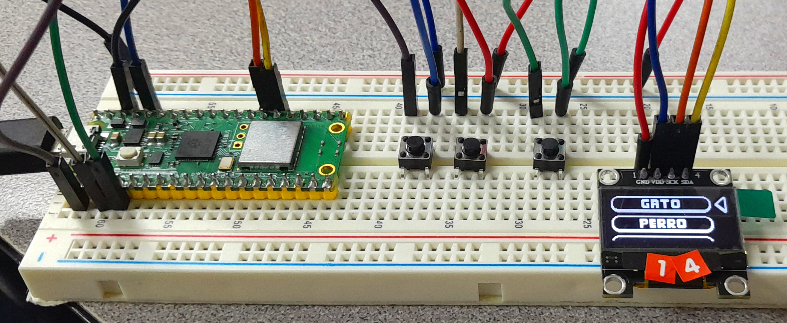
  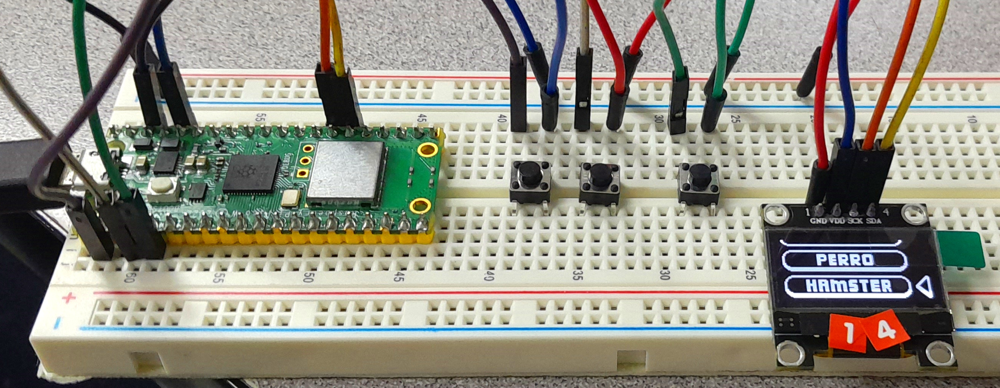
  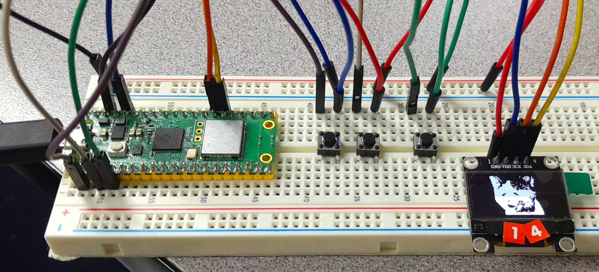
  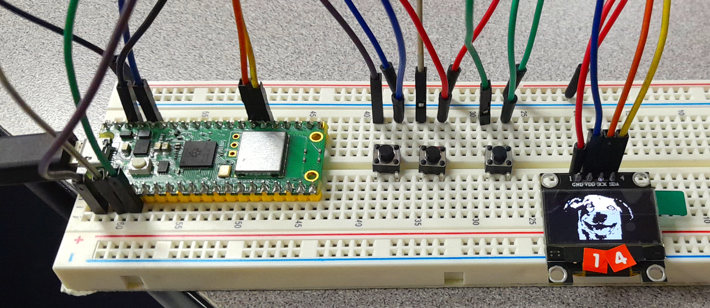
  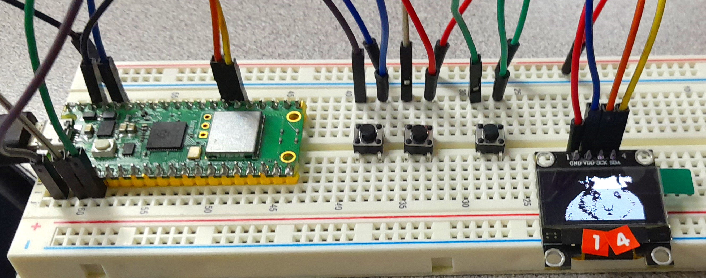
</center>

```python
# Hecho por Abner Ramirez Castaneda
#     con un numero de control de 20211828.
# Carrera de Ing. Sistemas Computacionales.
# Sistemas Programables B por Rene Solis Reyes.

import framebuf
from utime import sleep
from machine import Pin, I2C
from ssd1306 import SSD1306_I2C

pix_res_x = 128
pix_res_y = 64
onMenu = True
selectedOp = 1
bytesOpArrow = bytearray([
        0x00, 0x60, 0x00, 0xf0, 0x01, 0xf0, 0x03, 0xb0, 0x07, 0x30, 0x0e, 0x30, 0x1c, 0x30, 0x38, 0x30, 
        0x70, 0x30, 0xe0, 0x30, 0xf0, 0x30, 0xf8, 0x30, 0x7c, 0x30, 0x3e, 0x30, 0x1f, 0x30, 0x0f, 0xb0, 
        0x07, 0xf0, 0x03, 0xf0, 0x01, 0xf0, 0x00, 0xf0, 0x00, 0x60 ])
bytesOpCat = bytearray([
        0x03, 0xff, 0xff, 0xff, 0xff, 0xff, 0xff, 0xff, 0xff, 0xff, 0xff, 0xff, 0xc0, 0x0f, 0xff, 0xff, 
        0xff, 0xff, 0xff, 0xff, 0xff, 0xff, 0xff, 0xff, 0xff, 0xf0, 0x1c, 0x00, 0x00, 0x00, 0x00, 0x00, 
        0x00, 0x00, 0x00, 0x00, 0x00, 0x00, 0x38, 0x30, 0x00, 0x00, 0x00, 0x00, 0x00, 0x00, 0x00, 0x00, 
        0x00, 0x00, 0x00, 0x0c, 0x60, 0x00, 0x00, 0x00, 0x7f, 0x3f, 0x8f, 0xf8, 0xfe, 0x00, 0x00, 0x00, 
        0x06, 0x60, 0x00, 0x00, 0x00, 0xff, 0x3f, 0xcf, 0xf9, 0xff, 0x00, 0x00, 0x00, 0x06, 0xc0, 0x00, 
        0x00, 0x00, 0xff, 0x3f, 0xcf, 0xf9, 0xff, 0x00, 0x00, 0x00, 0x03, 0xc0, 0x00, 0x00, 0x00, 0xe0, 
        0x39, 0xc1, 0xc1, 0xc7, 0x00, 0x00, 0x00, 0x03, 0xc0, 0x00, 0x00, 0x00, 0xe0, 0x39, 0xc1, 0xc1, 
        0xc7, 0x00, 0x00, 0x00, 0x03, 0xc0, 0x00, 0x00, 0x00, 0xe7, 0x3f, 0xc1, 0xc1, 0xc7, 0x00, 0x00, 
        0x00, 0x03, 0xc0, 0x00, 0x00, 0x00, 0xe7, 0x3f, 0xc1, 0xc1, 0xc7, 0x00, 0x00, 0x00, 0x03, 0xc0, 
        0x00, 0x00, 0x00, 0xe3, 0x39, 0xc1, 0xc1, 0xc7, 0x00, 0x00, 0x00, 0x03, 0xc0, 0x00, 0x00, 0x00, 
        0xff, 0x39, 0xc1, 0xc1, 0xff, 0x00, 0x00, 0x00, 0x03, 0xe0, 0x00, 0x00, 0x00, 0xff, 0x39, 0xc1, 
        0xc1, 0xff, 0x00, 0x00, 0x00, 0x07, 0xe0, 0x00, 0x00, 0x00, 0x7f, 0x39, 0xc1, 0xc0, 0xfe, 0x00, 
        0x00, 0x00, 0x07, 0x70, 0x00, 0x00, 0x00, 0x00, 0x00, 0x00, 0x00, 0x00, 0x00, 0x00, 0x00, 0x0e, 
        0x7c, 0x00, 0x00, 0x00, 0x00, 0x00, 0x00, 0x00, 0x00, 0x00, 0x00, 0x00, 0x3e, 0x3f, 0xff, 0xff, 
        0xff, 0xff, 0xff, 0xff, 0xff, 0xff, 0xff, 0xff, 0xff, 0xfc, 0x1f, 0xff, 0xff, 0xff, 0xff, 0xff, 
        0xff, 0xff, 0xff, 0xff, 0xff, 0xff, 0xf8, 0x0f, 0xff, 0xff, 0xff, 0xff, 0xff, 0xff, 0xff, 0xff, 
        0xff, 0xff, 0xff, 0xf0, 0x03, 0xff, 0xff, 0xff, 0xff, 0xff, 0xff, 0xff, 0xff, 0xff, 0xff, 0xff, 
        0xc0 ])
bytesOpDog = bytearray([
        0x03, 0xff, 0xff, 0xff, 0xff, 0xff, 0xff, 0xff, 0xff, 0xff, 0xff, 0xff, 0xc0, 0x0f, 0xff, 0xff, 
        0xff, 0xff, 0xff, 0xff, 0xff, 0xff, 0xff, 0xff, 0xff, 0xf0, 0x1c, 0x00, 0x00, 0x00, 0x00, 0x00, 
        0x00, 0x00, 0x00, 0x00, 0x00, 0x00, 0x38, 0x30, 0x00, 0x00, 0x00, 0x00, 0x00, 0x00, 0x00, 0x00, 
        0x00, 0x00, 0x00, 0x0c, 0x60, 0x00, 0x00, 0x07, 0xf1, 0xf9, 0xfc, 0x7f, 0x0f, 0xe0, 0x00, 0x00, 
        0x06, 0x60, 0x00, 0x00, 0x07, 0xf9, 0xf9, 0xfe, 0x7f, 0x9f, 0xf0, 0x00, 0x00, 0x06, 0xc0, 0x00, 
        0x00, 0x07, 0xf9, 0xf9, 0xfe, 0x7f, 0x9f, 0xf0, 0x00, 0x00, 0x03, 0xc0, 0x00, 0x00, 0x07, 0x19, 
        0xf9, 0xc6, 0x71, 0x9c, 0x70, 0x00, 0x00, 0x03, 0xc0, 0x00, 0x00, 0x07, 0x19, 0xc1, 0xc6, 0x71, 
        0x9c, 0x70, 0x00, 0x00, 0x03, 0xc0, 0x00, 0x00, 0x07, 0xf9, 0xf9, 0xfe, 0x7f, 0x9c, 0x70, 0x00, 
        0x00, 0x03, 0xc0, 0x00, 0x00, 0x07, 0xf1, 0xf9, 0xfc, 0x7f, 0x1c, 0x70, 0x00, 0x00, 0x03, 0xc0, 
        0x00, 0x00, 0x07, 0x01, 0xc1, 0xf8, 0x7e, 0x1c, 0x70, 0x00, 0x00, 0x03, 0xc0, 0x00, 0x00, 0x07, 
        0x01, 0xf9, 0xfc, 0x7f, 0x1f, 0xf0, 0x00, 0x00, 0x03, 0xe0, 0x00, 0x00, 0x07, 0x01, 0xf9, 0xde, 
        0x77, 0x9f, 0xf0, 0x00, 0x00, 0x07, 0xe0, 0x00, 0x00, 0x07, 0x01, 0xf9, 0xce, 0x73, 0x8f, 0xe0, 
        0x00, 0x00, 0x07, 0x70, 0x00, 0x00, 0x00, 0x00, 0x00, 0x00, 0x00, 0x00, 0x00, 0x00, 0x00, 0x0e, 
        0x7c, 0x00, 0x00, 0x00, 0x00, 0x00, 0x00, 0x00, 0x00, 0x00, 0x00, 0x00, 0x3e, 0x3f, 0xff, 0xff, 
        0xff, 0xff, 0xff, 0xff, 0xff, 0xff, 0xff, 0xff, 0xff, 0xfc, 0x1f, 0xff, 0xff, 0xff, 0xff, 0xff, 
        0xff, 0xff, 0xff, 0xff, 0xff, 0xff, 0xf8, 0x0f, 0xff, 0xff, 0xff, 0xff, 0xff, 0xff, 0xff, 0xff, 
        0xff, 0xff, 0xff, 0xf0, 0x03, 0xff, 0xff, 0xff, 0xff, 0xff, 0xff, 0xff, 0xff, 0xff, 0xff, 0xff, 
        0xc0 ])
bytesOpSemiTop = bytearray([
        0x07, 0xff, 0xff, 0xff, 0xff, 0xff, 0xff, 0xff, 0xff, 0xff, 0xff, 0xff, 0x80, 0x1f, 0xff, 0xff, 
        0xff, 0xff, 0xff, 0xff, 0xff, 0xff, 0xff, 0xff, 0xff, 0xe0, 0x38, 0x00, 0x00, 0x00, 0x00, 0x00, 
        0x00, 0x00, 0x00, 0x00, 0x00, 0x00, 0x70, 0x60, 0x00, 0x00, 0x00, 0x00, 0x00, 0x00, 0x00, 0x00, 
        0x00, 0x00, 0x00, 0x18, 0xc0, 0x00, 0x00, 0x00, 0x00, 0x00, 0x00, 0x00, 0x00, 0x00, 0x00, 0x00, 
        0x0c, 0xc0, 0x00, 0x00, 0x00, 0x00, 0x00, 0x00, 0x00, 0x00, 0x00, 0x00, 0x00, 0x0c ])
bytesOpHamster = bytearray([
        0x03, 0xff, 0xff, 0xff, 0xff, 0xff, 0xff, 0xff, 0xff, 0xff, 0xff, 0xff, 0xc0, 0x0f, 0xff, 0xff, 
        0xff, 0xff, 0xff, 0xff, 0xff, 0xff, 0xff, 0xff, 0xff, 0xf0, 0x1c, 0x00, 0x00, 0x00, 0x00, 0x00, 
        0x00, 0x00, 0x00, 0x00, 0x00, 0x00, 0x38, 0x30, 0x00, 0x00, 0x00, 0x00, 0x00, 0x00, 0x00, 0x00, 
        0x00, 0x00, 0x00, 0x0c, 0x60, 0x00, 0x39, 0xcf, 0xe3, 0x80, 0x03, 0xf3, 0xf9, 0xfc, 0xfc, 0x00, 
        0x06, 0x60, 0x00, 0x39, 0xcf, 0xf3, 0xf3, 0xc7, 0xf3, 0xf9, 0xfc, 0xfe, 0x00, 0x06, 0xc0, 0x00, 
        0x39, 0xce, 0x73, 0xff, 0xe7, 0xf3, 0xf9, 0xfc, 0xfe, 0x00, 0x03, 0xc0, 0x00, 0x39, 0xce, 0x73, 
        0xff, 0xe7, 0x00, 0xe1, 0xfc, 0xe6, 0x00, 0x03, 0xc0, 0x00, 0x3f, 0xcf, 0xf3, 0x9c, 0xe7, 0xe0, 
        0xe1, 0xc0, 0xe6, 0x00, 0x03, 0xc0, 0x00, 0x3f, 0xcf, 0xf3, 0x9c, 0xe7, 0xf0, 0xe1, 0xfc, 0xfe, 
        0x00, 0x03, 0xc0, 0x00, 0x39, 0xce, 0x73, 0x9c, 0xe7, 0xf0, 0xe1, 0xfc, 0xfe, 0x00, 0x03, 0xc0, 
        0x00, 0x39, 0xce, 0x73, 0x9c, 0xe0, 0x70, 0xe1, 0xc0, 0xfc, 0x00, 0x03, 0xc0, 0x00, 0x39, 0xce, 
        0x73, 0x9c, 0xe7, 0xf0, 0xe1, 0xfc, 0xee, 0x00, 0x03, 0xe0, 0x00, 0x39, 0xce, 0x73, 0x9c, 0xe7, 
        0xf0, 0xe1, 0xfc, 0xe6, 0x00, 0x07, 0xe0, 0x00, 0x39, 0xce, 0x73, 0x9c, 0xe7, 0xe0, 0xe1, 0xfc, 
        0xe6, 0x00, 0x07, 0x70, 0x00, 0x00, 0x00, 0x00, 0x00, 0x00, 0x00, 0x00, 0x00, 0x00, 0x00, 0x0e, 
        0x7c, 0x00, 0x00, 0x00, 0x00, 0x00, 0x00, 0x00, 0x00, 0x00, 0x00, 0x00, 0x3e, 0x3f, 0xff, 0xff, 
        0xff, 0xff, 0xff, 0xff, 0xff, 0xff, 0xff, 0xff, 0xff, 0xfc, 0x1f, 0xff, 0xff, 0xff, 0xff, 0xff, 
        0xff, 0xff, 0xff, 0xff, 0xff, 0xff, 0xf8, 0x0f, 0xff, 0xff, 0xff, 0xff, 0xff, 0xff, 0xff, 0xff, 
        0xff, 0xff, 0xff, 0xf0, 0x03, 0xff, 0xff, 0xff, 0xff, 0xff, 0xff, 0xff, 0xff, 0xff, 0xff, 0xff, 
        0xc0 ])
bytesOpSemiBtm = bytearray([
        0xc0, 0x00, 0x00, 0x00, 0x00, 0x00, 0x00, 0x00, 0x00, 0x00, 0x00, 0x00, 0x0c, 0xc0, 0x00, 0x00, 
        0x00, 0x00, 0x00, 0x00, 0x00, 0x00, 0x00, 0x00, 0x00, 0x0c, 0x60, 0x00, 0x00, 0x00, 0x00, 0x00, 
        0x00, 0x00, 0x00, 0x00, 0x00, 0x00, 0x18, 0x38, 0x00, 0x00, 0x00, 0x00, 0x00, 0x00, 0x00, 0x00, 
        0x00, 0x00, 0x00, 0x70, 0x1f, 0xff, 0xff, 0xff, 0xff, 0xff, 0xff, 0xff, 0xff, 0xff, 0xff, 0xff, 
        0xe0, 0x07, 0xff, 0xff, 0xff, 0xff, 0xff, 0xff, 0xff, 0xff, 0xff, 0xff, 0xff, 0x80 ])
bytesScrnCat = bytearray([
        0x00, 0x00, 0x00, 0x17, 0x88, 0x00, 0x00, 0x00, 0x01, 0x00, 0x20, 0x00, 0x00, 0x00, 0x00, 0x00, 
        0x00, 0x00, 0x00, 0x1f, 0x2c, 0x00, 0x00, 0x00, 0x00, 0x03, 0xd0, 0x80, 0x00, 0x00, 0x00, 0x00, 
        0x00, 0x00, 0x00, 0x1f, 0xe2, 0x00, 0x00, 0x00, 0x02, 0x0a, 0x38, 0x80, 0x00, 0x00, 0x00, 0x00, 
        0x00, 0x00, 0x00, 0x1f, 0xe7, 0x00, 0x00, 0x00, 0x00, 0x13, 0x58, 0x80, 0x00, 0x00, 0x00, 0x00, 
        0x00, 0x00, 0x00, 0x0f, 0xf8, 0x80, 0x00, 0x00, 0x00, 0x0c, 0xf0, 0x80, 0x00, 0x00, 0x00, 0x00, 
        0x00, 0x00, 0x00, 0x0f, 0xee, 0x80, 0x00, 0x00, 0x00, 0x0b, 0xe1, 0xa0, 0x00, 0x00, 0x00, 0x00, 
        0x00, 0x00, 0x00, 0x0f, 0xf8, 0x40, 0x00, 0x00, 0x00, 0x00, 0x79, 0xe0, 0x00, 0x00, 0x00, 0x00, 
        0x00, 0x00, 0x00, 0x0f, 0xff, 0x20, 0x00, 0x00, 0x00, 0x02, 0x61, 0xc0, 0x00, 0x00, 0x00, 0x00, 
        0x00, 0x00, 0x00, 0x07, 0xfe, 0x10, 0x1f, 0x80, 0x00, 0x01, 0x81, 0xc0, 0x00, 0x00, 0x00, 0x00, 
        0x00, 0x00, 0x00, 0x07, 0xf8, 0x20, 0x0f, 0x00, 0x00, 0x00, 0x03, 0xc0, 0x00, 0x00, 0x00, 0x00, 
        0x00, 0x00, 0x00, 0x07, 0xfe, 0x00, 0x1e, 0x20, 0x00, 0x00, 0x03, 0xc0, 0x00, 0x00, 0x00, 0x00, 
        0x00, 0x00, 0x00, 0x07, 0xe7, 0x00, 0x3f, 0x00, 0x40, 0x01, 0x07, 0xc0, 0x00, 0x00, 0x00, 0x00, 
        0x00, 0x00, 0x00, 0x07, 0xf3, 0x00, 0x7f, 0x00, 0x00, 0x00, 0x03, 0x80, 0x00, 0x00, 0x00, 0x00, 
        0x00, 0x00, 0x00, 0x03, 0xff, 0x82, 0x7f, 0x00, 0x02, 0x00, 0x07, 0x00, 0x00, 0x00, 0x00, 0x00, 
        0x00, 0x00, 0x00, 0x03, 0xff, 0x8f, 0xff, 0x68, 0x02, 0x00, 0x03, 0x00, 0x00, 0x00, 0x00, 0x00, 
        0x00, 0x00, 0x00, 0x03, 0xff, 0x0f, 0xff, 0x00, 0x00, 0x40, 0x43, 0x80, 0x00, 0x00, 0x00, 0x00, 
        0x00, 0x00, 0x00, 0x03, 0xff, 0x0f, 0xff, 0x00, 0x40, 0x20, 0x07, 0x80, 0x00, 0x00, 0x00, 0x00, 
        0x00, 0x00, 0x00, 0x03, 0xdc, 0x0f, 0xff, 0xc4, 0x00, 0x28, 0x41, 0x80, 0x00, 0x00, 0x00, 0x00, 
        0x00, 0x00, 0x00, 0x01, 0xfc, 0x9f, 0xff, 0xc2, 0x80, 0x84, 0x01, 0x00, 0x00, 0x00, 0x00, 0x00, 
        0x00, 0x00, 0x00, 0x01, 0xf8, 0xff, 0xff, 0xe1, 0x00, 0x03, 0xc0, 0x00, 0x00, 0x00, 0x00, 0x00, 
        0x00, 0x00, 0x00, 0x00, 0xfb, 0xff, 0xff, 0xe6, 0x10, 0x08, 0xc0, 0x00, 0x00, 0x00, 0x00, 0x00, 
        0x00, 0x00, 0x00, 0x01, 0xe9, 0xff, 0xff, 0xfb, 0x00, 0x30, 0xc0, 0x00, 0x00, 0x00, 0x00, 0x00, 
        0x00, 0x00, 0x00, 0x01, 0xfb, 0xff, 0xff, 0xfe, 0x08, 0x00, 0x60, 0x00, 0x00, 0x00, 0x00, 0x00, 
        0x00, 0x00, 0x00, 0x01, 0xff, 0xff, 0xff, 0xfa, 0x1a, 0xa8, 0x60, 0x00, 0x00, 0x00, 0x00, 0x00, 
        0x00, 0x00, 0x00, 0x01, 0xff, 0xff, 0xff, 0xff, 0x5f, 0xff, 0x70, 0x00, 0x00, 0x00, 0x00, 0x00, 
        0x00, 0x00, 0x00, 0x01, 0xff, 0xff, 0xff, 0xff, 0xff, 0xff, 0xfc, 0x00, 0x00, 0x00, 0x00, 0x00, 
        0x00, 0x00, 0x00, 0x01, 0xff, 0xff, 0xff, 0xff, 0xbf, 0xff, 0xfc, 0x00, 0x00, 0x00, 0x00, 0x00, 
        0x00, 0x00, 0x00, 0x01, 0xff, 0xff, 0xff, 0xff, 0xff, 0xff, 0xff, 0xc0, 0x00, 0x00, 0x00, 0x00, 
        0x00, 0x00, 0x00, 0x01, 0xff, 0xff, 0xbf, 0xe3, 0xff, 0xff, 0xff, 0xc0, 0x00, 0x00, 0x00, 0x00, 
        0x00, 0x00, 0x00, 0x01, 0xff, 0xf8, 0xff, 0xc1, 0xff, 0xff, 0xfe, 0xc0, 0x00, 0x00, 0x00, 0x00, 
        0x00, 0x00, 0x00, 0x01, 0xff, 0xe1, 0xff, 0xe0, 0xff, 0xff, 0xfe, 0x00, 0x00, 0x00, 0x00, 0x00, 
        0x00, 0x00, 0x00, 0x01, 0xff, 0xc3, 0xff, 0xf8, 0x7f, 0xff, 0xff, 0x00, 0x00, 0x00, 0x00, 0x00, 
        0x00, 0x00, 0x00, 0x01, 0xff, 0x85, 0xff, 0xfa, 0x3f, 0xff, 0xff, 0x40, 0x00, 0x00, 0x00, 0x00, 
        0x00, 0x00, 0x00, 0x01, 0xff, 0xc7, 0xff, 0xff, 0xdf, 0xff, 0xff, 0x40, 0x00, 0x00, 0x00, 0x00, 
        0x00, 0x00, 0x00, 0x01, 0xff, 0xff, 0xff, 0xff, 0xff, 0xff, 0xb3, 0x00, 0x00, 0x00, 0x00, 0x00, 
        0x00, 0x00, 0x00, 0x01, 0xff, 0xff, 0xff, 0xff, 0xff, 0xff, 0x1c, 0x80, 0x00, 0x00, 0x00, 0x00, 
        0x00, 0x00, 0x00, 0x01, 0xff, 0xff, 0xff, 0xff, 0xff, 0xff, 0x98, 0x00, 0x00, 0x00, 0x00, 0x00, 
        0x00, 0x00, 0x00, 0x01, 0xff, 0xff, 0xff, 0xff, 0xff, 0xff, 0xc0, 0x00, 0x00, 0x00, 0x00, 0x00, 
        0x00, 0x00, 0x00, 0x01, 0xff, 0xff, 0xff, 0xff, 0xff, 0xff, 0x80, 0x80, 0x00, 0x00, 0x00, 0x00, 
        0x00, 0x00, 0x00, 0x01, 0xff, 0xff, 0xff, 0xff, 0xff, 0xff, 0x90, 0x80, 0x00, 0x00, 0x00, 0x00, 
        0x00, 0x00, 0x00, 0x00, 0xff, 0xff, 0xe7, 0xff, 0xff, 0xff, 0xe1, 0x40, 0x00, 0x00, 0x00, 0x00, 
        0x00, 0x00, 0x00, 0x00, 0xff, 0xff, 0x8f, 0xff, 0x03, 0xff, 0x61, 0xc0, 0x00, 0x00, 0x00, 0x00, 
        0x00, 0x00, 0x00, 0x00, 0xff, 0xfb, 0x1f, 0xfe, 0x03, 0xff, 0x85, 0xe0, 0x00, 0x00, 0x00, 0x00, 
        0x00, 0x00, 0x00, 0x00, 0x7f, 0xff, 0xbf, 0xfe, 0x31, 0xf3, 0xe1, 0xf0, 0x00, 0x00, 0x00, 0x00, 
        0x00, 0x00, 0x00, 0x00, 0x3f, 0xfe, 0xff, 0xfe, 0x83, 0xe2, 0xc1, 0xf0, 0x00, 0x00, 0x00, 0x00, 
        0x00, 0x00, 0x00, 0x00, 0x1f, 0xff, 0xff, 0xfe, 0x34, 0x7f, 0xf9, 0xf8, 0x00, 0x00, 0x00, 0x00, 
        0x00, 0x00, 0x00, 0x00, 0x1f, 0xff, 0x7f, 0xf8, 0x84, 0x2f, 0xf1, 0xf8, 0x00, 0x00, 0x00, 0x00, 
        0x00, 0x00, 0x00, 0x00, 0x0f, 0xff, 0x3f, 0xf8, 0x41, 0x7f, 0xa1, 0xf8, 0x00, 0x00, 0x00, 0x00, 
        0x00, 0x00, 0x00, 0x00, 0x07, 0xfe, 0x03, 0xe9, 0x60, 0xfe, 0x43, 0xfc, 0x00, 0x00, 0x00, 0x00, 
        0x00, 0x00, 0x00, 0x00, 0x03, 0xfc, 0x00, 0x31, 0xe8, 0xfe, 0x92, 0xfc, 0x00, 0x00, 0x00, 0x00, 
        0x00, 0x00, 0x00, 0x00, 0x03, 0xff, 0x00, 0x1f, 0xf4, 0xfe, 0x03, 0xfc, 0x00, 0x00, 0x00, 0x00, 
        0x00, 0x00, 0x00, 0x00, 0x01, 0xff, 0x80, 0x47, 0xe3, 0x88, 0x83, 0xde, 0x00, 0x00, 0x00, 0x00, 
        0x00, 0x00, 0x00, 0x00, 0x00, 0xff, 0x80, 0xd7, 0xc1, 0x01, 0x03, 0xfe, 0x00, 0x00, 0x00, 0x00, 
        0x00, 0x00, 0x00, 0x00, 0x00, 0x7f, 0xff, 0x87, 0xa0, 0x90, 0x03, 0xfe, 0x00, 0x00, 0x00, 0x00, 
        0x00, 0x00, 0x00, 0x00, 0x00, 0x7f, 0xff, 0x87, 0x80, 0x00, 0x03, 0xff, 0x00, 0x00, 0x00, 0x00, 
        0x00, 0x00, 0x00, 0x00, 0x00, 0x1f, 0xff, 0x8f, 0x00, 0x00, 0x01, 0xff, 0x00, 0x00, 0x00, 0x00, 
        0x00, 0x00, 0x00, 0x00, 0x00, 0x0f, 0xff, 0x1e, 0x80, 0x00, 0x07, 0xff, 0x00, 0x00, 0x00, 0x00, 
        0x00, 0x00, 0x00, 0x00, 0x00, 0x0f, 0xff, 0xc8, 0x00, 0x10, 0x05, 0xff, 0x00, 0x00, 0x00, 0x00, 
        0x00, 0x00, 0x00, 0x00, 0x00, 0x1f, 0xff, 0xe0, 0x00, 0x10, 0x07, 0xff, 0x80, 0x00, 0x00, 0x00, 
        0x00, 0x00, 0x00, 0x00, 0x00, 0x1f, 0xff, 0xc0, 0x02, 0x08, 0x0f, 0xff, 0x80, 0x00, 0x00, 0x00, 
        0x00, 0x00, 0x00, 0x00, 0x00, 0x1f, 0xff, 0x8f, 0xbf, 0xa6, 0xff, 0xff, 0x80, 0x00, 0x00, 0x00, 
        0x00, 0x00, 0x00, 0x00, 0x00, 0x1f, 0xff, 0xff, 0xbf, 0xe7, 0xff, 0xff, 0x80, 0x00, 0x00, 0x00, 
        0x00, 0x00, 0x00, 0x00, 0x00, 0x1f, 0xff, 0xff, 0xdf, 0x79, 0xff, 0xff, 0x80, 0x00, 0x00, 0x00, 
        0x00, 0x00, 0x00, 0x00, 0x00, 0x1f, 0xff, 0xff, 0xff, 0xff, 0x7f, 0xff, 0x80, 0x00, 0x00, 0x00 ])
bytesScrnDog = bytearray([
        0x00, 0x00, 0x00, 0x00, 0x00, 0x00, 0x1f, 0xfc, 0x00, 0x00, 0x00, 0x00, 0x00, 0x00, 0x00, 0x00, 
        0x00, 0x00, 0x00, 0x00, 0x00, 0x00, 0x7f, 0xff, 0xe0, 0x00, 0x00, 0x00, 0x00, 0x00, 0x00, 0x00, 
        0x00, 0x00, 0x00, 0x00, 0x00, 0x01, 0xff, 0xff, 0xfc, 0x00, 0x00, 0x00, 0x00, 0x00, 0x00, 0x00, 
        0x00, 0x00, 0x00, 0x00, 0x00, 0x03, 0xff, 0xff, 0xff, 0x80, 0x00, 0x00, 0x00, 0x00, 0x00, 0x00, 
        0x00, 0x00, 0x00, 0x00, 0x24, 0x03, 0xdf, 0xff, 0x3f, 0xf0, 0x00, 0x00, 0x00, 0x00, 0x00, 0x00, 
        0x00, 0x00, 0x00, 0x00, 0xfc, 0x03, 0xaf, 0xff, 0x3f, 0xff, 0x00, 0x00, 0x00, 0x00, 0x00, 0x00, 
        0x00, 0x00, 0x00, 0x03, 0x83, 0x87, 0x0f, 0xff, 0xbf, 0xff, 0xe2, 0x00, 0x00, 0x00, 0x00, 0x00, 
        0x00, 0x00, 0x00, 0x07, 0x03, 0x0e, 0x1f, 0xff, 0xff, 0xff, 0xc0, 0x00, 0x00, 0x00, 0x00, 0x00, 
        0x00, 0x00, 0x00, 0x4e, 0x00, 0x0c, 0x1f, 0xff, 0xff, 0xff, 0xc0, 0x20, 0x00, 0x00, 0x00, 0x00, 
        0x00, 0x00, 0x00, 0x88, 0x00, 0x19, 0xf9, 0xff, 0xff, 0xff, 0xc0, 0x10, 0x00, 0x00, 0x00, 0x00, 
        0x00, 0x00, 0x00, 0x10, 0x00, 0x1b, 0xf0, 0xff, 0xff, 0xff, 0xe0, 0x00, 0x00, 0x00, 0x00, 0x00, 
        0x00, 0x00, 0x00, 0x23, 0xc3, 0xf7, 0xf8, 0xff, 0xff, 0xff, 0xe0, 0x00, 0x00, 0x00, 0x00, 0x00, 
        0x00, 0x00, 0x02, 0x41, 0xe7, 0xee, 0x01, 0xff, 0xff, 0xf7, 0xf0, 0x02, 0x00, 0x00, 0x00, 0x00, 
        0x00, 0x00, 0x06, 0x05, 0xff, 0xcc, 0x00, 0xff, 0xff, 0xff, 0xf0, 0x01, 0x00, 0x00, 0x00, 0x00, 
        0x00, 0x00, 0x06, 0x1f, 0xff, 0x08, 0x78, 0xff, 0xff, 0xff, 0xf0, 0x01, 0x80, 0x00, 0x00, 0x00, 
        0x00, 0x00, 0x0c, 0x1f, 0xfc, 0x00, 0x98, 0x7f, 0xff, 0xf0, 0xf8, 0x00, 0xc0, 0x00, 0x00, 0x00, 
        0x00, 0x00, 0x0c, 0x1f, 0xf0, 0x00, 0x90, 0x3f, 0xff, 0xc0, 0x78, 0x00, 0x40, 0x00, 0x00, 0x00, 
        0x00, 0x00, 0x18, 0x03, 0xc0, 0x00, 0xe0, 0x3f, 0xff, 0x0e, 0x3c, 0x00, 0x20, 0x00, 0x00, 0x00, 
        0x00, 0x00, 0x00, 0x00, 0x80, 0x00, 0x02, 0xff, 0xff, 0x19, 0x1f, 0x00, 0x00, 0x00, 0x00, 0x00, 
        0x00, 0x00, 0x20, 0x00, 0x00, 0x01, 0xfe, 0x7f, 0xff, 0x19, 0x9f, 0x80, 0x08, 0x00, 0x00, 0x00, 
        0x00, 0x00, 0x00, 0x00, 0x00, 0x01, 0xfe, 0x7f, 0xff, 0x8f, 0x87, 0x80, 0x08, 0x00, 0x00, 0x00, 
        0x00, 0x00, 0x00, 0x00, 0x00, 0x00, 0xfc, 0x7f, 0xff, 0xe0, 0x17, 0xc0, 0x04, 0x00, 0x00, 0x00, 
        0x00, 0x00, 0x00, 0x00, 0x03, 0x00, 0x7c, 0xff, 0xff, 0xfe, 0x77, 0xc0, 0x04, 0x00, 0x00, 0x00, 
        0x00, 0x00, 0x08, 0x00, 0x0e, 0x00, 0x79, 0xff, 0xff, 0xff, 0xf7, 0xe0, 0x04, 0x00, 0x00, 0x00, 
        0x00, 0x00, 0x00, 0x00, 0x0a, 0x00, 0x33, 0xff, 0xff, 0xff, 0xff, 0x20, 0x06, 0x00, 0x00, 0x00, 
        0x00, 0x00, 0x00, 0x00, 0x0e, 0x00, 0x2f, 0xc0, 0xff, 0xff, 0xdf, 0x20, 0x06, 0x00, 0x00, 0x00, 
        0x00, 0x00, 0x00, 0x00, 0x0c, 0x00, 0x7f, 0xc0, 0xff, 0xff, 0xff, 0x00, 0x02, 0x00, 0x00, 0x00, 
        0x00, 0x00, 0x00, 0x00, 0x0c, 0x00, 0xff, 0xc0, 0xbf, 0xff, 0x7f, 0x00, 0x02, 0x00, 0x00, 0x00, 
        0x00, 0x00, 0x00, 0x00, 0x0c, 0x0c, 0x1e, 0x80, 0x03, 0xfd, 0xff, 0x00, 0x02, 0x00, 0x00, 0x00, 
        0x00, 0x00, 0x00, 0x00, 0x0c, 0x1c, 0x3e, 0x80, 0x00, 0xff, 0xff, 0x00, 0x02, 0x00, 0x00, 0x00, 
        0x00, 0x00, 0x00, 0x00, 0x0c, 0x3e, 0x3e, 0x00, 0x00, 0xff, 0xff, 0x00, 0x03, 0x00, 0x00, 0x00, 
        0x00, 0x00, 0x00, 0x00, 0x08, 0x7f, 0xfe, 0x80, 0x00, 0xff, 0xff, 0x00, 0x01, 0x00, 0x00, 0x00, 
        0x00, 0x00, 0x00, 0x00, 0x08, 0xff, 0xfc, 0x00, 0x00, 0xff, 0xff, 0x00, 0x01, 0x00, 0x00, 0x00, 
        0x00, 0x00, 0x00, 0x00, 0x08, 0xf1, 0xfc, 0x00, 0x01, 0xff, 0xff, 0x00, 0x01, 0x00, 0x00, 0x00, 
        0x00, 0x00, 0x00, 0x00, 0x09, 0xe7, 0xf8, 0x00, 0x0d, 0xff, 0xff, 0x00, 0x02, 0x00, 0x00, 0x00, 
        0x00, 0x00, 0x00, 0x00, 0x09, 0xef, 0xf0, 0x00, 0x01, 0xff, 0xff, 0x00, 0x00, 0x00, 0x00, 0x00, 
        0x00, 0x00, 0x00, 0x00, 0x09, 0x3f, 0xf8, 0x00, 0x03, 0xff, 0xff, 0x00, 0x08, 0x00, 0x00, 0x00, 
        0x00, 0x00, 0x00, 0x00, 0x19, 0x3f, 0xf8, 0x00, 0x07, 0xff, 0xff, 0x00, 0x00, 0x00, 0x00, 0x00, 
        0x00, 0x00, 0x00, 0x00, 0x19, 0x8f, 0xe0, 0x00, 0x0f, 0xff, 0xff, 0x00, 0x00, 0x00, 0x00, 0x00, 
        0x00, 0x00, 0x00, 0x00, 0x1d, 0x83, 0xf0, 0x08, 0x1f, 0xff, 0xff, 0x00, 0x00, 0x00, 0x00, 0x00, 
        0x00, 0x00, 0x00, 0x00, 0x3f, 0xc1, 0xf8, 0x02, 0x5f, 0xff, 0xdf, 0x00, 0x00, 0x00, 0x00, 0x00, 
        0x00, 0x00, 0x00, 0x00, 0x3d, 0xc0, 0xfe, 0x67, 0x3f, 0xfc, 0x1f, 0x00, 0x00, 0x00, 0x00, 0x00, 
        0x00, 0x00, 0x00, 0x00, 0x3c, 0xc0, 0x3f, 0x80, 0x7f, 0xf8, 0x1f, 0x00, 0x00, 0x00, 0x00, 0x00, 
        0x00, 0x00, 0x00, 0x00, 0x3c, 0xe0, 0x00, 0x00, 0x0f, 0xf0, 0x3e, 0x00, 0x00, 0x00, 0x00, 0x00, 
        0x00, 0x00, 0x00, 0x00, 0x3e, 0xe0, 0x00, 0x00, 0x00, 0x00, 0x7e, 0x00, 0x00, 0x00, 0x00, 0x00, 
        0x00, 0x00, 0x00, 0x00, 0x3f, 0xf8, 0x10, 0x00, 0x00, 0x00, 0x7e, 0x00, 0x00, 0x00, 0x00, 0x00, 
        0x00, 0x00, 0x00, 0x00, 0x3f, 0xf0, 0x10, 0x00, 0x00, 0x02, 0xfe, 0x00, 0x00, 0x00, 0x00, 0x00, 
        0x00, 0x00, 0x00, 0x00, 0x3f, 0x9c, 0x04, 0x00, 0x03, 0x85, 0xfe, 0x00, 0x00, 0x00, 0x00, 0x00, 
        0x00, 0x00, 0x00, 0x00, 0x3f, 0xf8, 0x06, 0x00, 0x3f, 0xad, 0xf6, 0x00, 0x00, 0x00, 0x00, 0x00, 
        0x00, 0x00, 0x00, 0x00, 0x78, 0xfe, 0x0a, 0x00, 0xff, 0xdb, 0xde, 0x00, 0x00, 0x00, 0x00, 0x00, 
        0x00, 0x00, 0x00, 0x00, 0x7c, 0x3f, 0x0e, 0x19, 0xff, 0xbf, 0xde, 0x00, 0x00, 0x00, 0x00, 0x00, 
        0x00, 0x00, 0x00, 0x00, 0x78, 0x1f, 0xc7, 0xfb, 0xff, 0x77, 0xfe, 0x00, 0x00, 0x00, 0x00, 0x00, 
        0x00, 0x00, 0x00, 0x00, 0x7c, 0x1e, 0xff, 0xff, 0xfe, 0x3f, 0xfe, 0x00, 0x00, 0x00, 0x00, 0x00, 
        0x00, 0x00, 0x00, 0x00, 0x3c, 0x07, 0x7b, 0xff, 0xfd, 0x5f, 0xfe, 0x00, 0x00, 0x00, 0x00, 0x00, 
        0x00, 0x00, 0x00, 0x00, 0x7c, 0x03, 0xbf, 0xff, 0xff, 0xbf, 0xfe, 0x00, 0x00, 0x00, 0x00, 0x00, 
        0x00, 0x00, 0x00, 0x00, 0x3c, 0x03, 0xd0, 0xff, 0xff, 0x3b, 0xfe, 0x00, 0x00, 0x00, 0x00, 0x00, 
        0x00, 0x00, 0x00, 0x00, 0x3e, 0x01, 0xfc, 0x7f, 0xfe, 0x67, 0xfe, 0x00, 0x00, 0x00, 0x00, 0x00, 
        0x00, 0x00, 0x00, 0x00, 0x3f, 0x81, 0xfc, 0x3f, 0xed, 0xff, 0xfc, 0x00, 0x00, 0x00, 0x00, 0x00, 
        0x00, 0x00, 0x00, 0x00, 0x3f, 0x83, 0xf8, 0x00, 0x0f, 0xff, 0xfc, 0x00, 0x00, 0x00, 0x00, 0x00, 
        0x00, 0x00, 0x00, 0x00, 0x3f, 0x83, 0xf8, 0x00, 0x9f, 0xff, 0xfc, 0x00, 0x00, 0x00, 0x00, 0x00, 
        0x00, 0x00, 0x00, 0x00, 0x3f, 0xc1, 0xfc, 0x00, 0x0f, 0xff, 0xfc, 0x00, 0x00, 0x00, 0x00, 0x00, 
        0x00, 0x00, 0x00, 0x00, 0x3f, 0xc1, 0xfc, 0x00, 0x0f, 0xff, 0xfc, 0x00, 0x00, 0x00, 0x00, 0x00, 
        0x00, 0x00, 0x00, 0x00, 0x3f, 0xc2, 0xbe, 0x00, 0x7f, 0xff, 0xfc, 0x00, 0x00, 0x00, 0x00, 0x00, 
        0x00, 0x00, 0x00, 0x00, 0x3f, 0xc2, 0x9f, 0xc2, 0xff, 0xff, 0xfc, 0x00, 0x00, 0x00, 0x00, 0x00 ])
bytesScrnHamster = bytearray([
        0x00, 0x00, 0x00, 0x00, 0x00, 0x00, 0x00, 0x00, 0x00, 0x00, 0x00, 0x00, 0x00, 0x00, 0x00, 0x00, 
        0x00, 0x00, 0x00, 0x00, 0x00, 0x00, 0x00, 0x00, 0x00, 0x00, 0x00, 0x00, 0x00, 0x00, 0x00, 0x00, 
        0x00, 0x00, 0x00, 0x00, 0x00, 0x00, 0x00, 0x00, 0x00, 0x00, 0x00, 0x40, 0x00, 0x00, 0x00, 0x00, 
        0x00, 0x00, 0x00, 0x00, 0x00, 0x00, 0x00, 0x00, 0x00, 0x00, 0x00, 0x00, 0x00, 0x00, 0x00, 0x00, 
        0x00, 0x00, 0x00, 0x00, 0x00, 0x00, 0x20, 0x10, 0x00, 0x00, 0xe0, 0x00, 0x00, 0x00, 0x00, 0x00, 
        0x00, 0x00, 0x00, 0x00, 0x00, 0x00, 0x60, 0x18, 0x00, 0x01, 0xe0, 0x40, 0x90, 0x00, 0x00, 0x00, 
        0x00, 0x00, 0x00, 0x00, 0x00, 0x00, 0x20, 0x3e, 0x00, 0x0f, 0xf8, 0xf0, 0xc0, 0x00, 0x00, 0x00, 
        0x00, 0x00, 0x00, 0x00, 0x00, 0x00, 0x26, 0xff, 0x98, 0x7f, 0xf0, 0xff, 0x7c, 0x00, 0x00, 0x00, 
        0x00, 0x00, 0x00, 0x00, 0x00, 0x00, 0x21, 0xff, 0xff, 0xff, 0xf0, 0xff, 0xf8, 0x00, 0x00, 0x00, 
        0x00, 0x00, 0x00, 0x00, 0x00, 0x80, 0x60, 0xff, 0xff, 0xff, 0xf0, 0xbf, 0xfc, 0x00, 0x00, 0x00, 
        0x00, 0x00, 0x00, 0x00, 0x00, 0x00, 0xe0, 0x1f, 0xff, 0x7f, 0xf0, 0xf7, 0xfc, 0x00, 0x00, 0x00, 
        0x00, 0x00, 0x00, 0x00, 0x00, 0x28, 0x10, 0x1f, 0xff, 0xff, 0xf0, 0xf0, 0x58, 0x00, 0x00, 0x00, 
        0x00, 0x00, 0x00, 0x00, 0x00, 0x14, 0x10, 0x3f, 0xff, 0xff, 0xf0, 0xf8, 0x04, 0x00, 0x00, 0x00, 
        0x00, 0x00, 0x00, 0x00, 0x00, 0x00, 0x00, 0x1f, 0xdf, 0xff, 0xf8, 0x78, 0x00, 0x00, 0x00, 0x00, 
        0x00, 0x00, 0x00, 0x00, 0x00, 0x00, 0x00, 0x1f, 0xff, 0xff, 0xf8, 0xfc, 0x00, 0x00, 0x00, 0x00, 
        0x00, 0x00, 0x00, 0x00, 0x00, 0x00, 0x40, 0x3f, 0xff, 0xff, 0xfc, 0x7c, 0x00, 0x00, 0x00, 0x00, 
        0x00, 0x00, 0x00, 0x00, 0x00, 0x01, 0xc0, 0x7f, 0xff, 0xff, 0xfe, 0x1e, 0x00, 0x00, 0x00, 0x00, 
        0x00, 0x00, 0x00, 0x00, 0x00, 0x00, 0x60, 0x3f, 0xff, 0xff, 0xff, 0xbe, 0x00, 0x00, 0x00, 0x00, 
        0x00, 0x00, 0x00, 0x00, 0x00, 0x00, 0x40, 0xff, 0xff, 0xff, 0xfb, 0xff, 0x00, 0x00, 0x00, 0x00, 
        0x00, 0x00, 0x00, 0x00, 0x00, 0x00, 0x82, 0xff, 0xff, 0xff, 0xff, 0xa0, 0x00, 0x00, 0x00, 0x00, 
        0x00, 0x00, 0x00, 0x00, 0x00, 0x00, 0x01, 0xff, 0xff, 0xff, 0xff, 0x00, 0x00, 0x00, 0x00, 0x00, 
        0x00, 0x00, 0x00, 0x00, 0x00, 0x00, 0x00, 0x7f, 0xff, 0x7f, 0xff, 0x00, 0x00, 0x00, 0x00, 0x00, 
        0x00, 0x00, 0x00, 0x00, 0x00, 0x00, 0x01, 0xbf, 0xff, 0xff, 0xff, 0x00, 0x00, 0x00, 0x00, 0x00, 
        0x00, 0x00, 0x00, 0x00, 0x00, 0x00, 0x03, 0x5f, 0xff, 0xff, 0xff, 0xce, 0x00, 0x00, 0x00, 0x00, 
        0x00, 0x00, 0x00, 0x00, 0x00, 0x1c, 0x08, 0x0f, 0xff, 0xff, 0xff, 0xc1, 0x00, 0x00, 0x00, 0x00, 
        0x00, 0x00, 0x00, 0x00, 0x00, 0x30, 0x09, 0x07, 0xff, 0xff, 0x8f, 0xc2, 0xc0, 0x00, 0x00, 0x00, 
        0x00, 0x00, 0x00, 0x00, 0x00, 0x60, 0x02, 0x02, 0xff, 0xff, 0x07, 0xfd, 0x60, 0x00, 0x00, 0x00, 
        0x00, 0x00, 0x00, 0x00, 0x00, 0xf0, 0x04, 0x01, 0xff, 0xfe, 0x27, 0xff, 0xe0, 0x00, 0x00, 0x00, 
        0x00, 0x00, 0x00, 0x00, 0x01, 0xe0, 0x06, 0x30, 0xff, 0xfe, 0x73, 0xff, 0xf8, 0x00, 0x00, 0x00, 
        0x00, 0x00, 0x00, 0x00, 0x03, 0xc0, 0xea, 0x79, 0xff, 0xfe, 0x73, 0xff, 0xfc, 0x00, 0x00, 0x00, 
        0x00, 0x00, 0x00, 0x00, 0x0f, 0xc1, 0xf0, 0x79, 0xff, 0xfe, 0x33, 0xff, 0xfe, 0x00, 0x00, 0x00, 
        0x00, 0x00, 0x00, 0x00, 0x0f, 0x4d, 0xfe, 0x33, 0xff, 0xfe, 0x01, 0xff, 0xfe, 0x00, 0x00, 0x00, 
        0x00, 0x00, 0x00, 0x00, 0x1f, 0x7f, 0xfc, 0x03, 0xff, 0xff, 0x81, 0xff, 0xff, 0x80, 0x00, 0x00, 
        0x00, 0x00, 0x00, 0x00, 0x3f, 0xaf, 0xfc, 0x04, 0xff, 0xff, 0xc1, 0xff, 0xff, 0x80, 0x00, 0x00, 
        0x00, 0x00, 0x00, 0x00, 0x7e, 0x1f, 0xf8, 0x04, 0xff, 0xff, 0xe1, 0xff, 0xff, 0xc0, 0x00, 0x00, 
        0x00, 0x00, 0x00, 0x00, 0xfe, 0x7f, 0xf8, 0x3b, 0x7f, 0xff, 0xff, 0xfe, 0xff, 0xc0, 0x00, 0x00, 
        0x00, 0x00, 0x00, 0x01, 0xff, 0x3f, 0xfc, 0x3e, 0xff, 0xff, 0xff, 0xff, 0xff, 0xe0, 0x00, 0x00, 
        0x00, 0x00, 0x00, 0x07, 0xfe, 0x3f, 0xfb, 0x1f, 0xff, 0xff, 0xff, 0xff, 0xff, 0xe0, 0x00, 0x00, 
        0x00, 0x00, 0x00, 0x07, 0xfe, 0x0f, 0xfc, 0xdf, 0xff, 0xff, 0xff, 0xff, 0xbf, 0xe0, 0x00, 0x00, 
        0x00, 0x00, 0x00, 0x0f, 0xfc, 0x0f, 0xff, 0xbf, 0xff, 0xff, 0xff, 0xff, 0xff, 0xf0, 0x00, 0x00, 
        0x00, 0x00, 0x00, 0x1f, 0xff, 0x17, 0xff, 0xfb, 0xff, 0xff, 0xff, 0xff, 0xf7, 0xf0, 0x00, 0x00, 
        0x00, 0x00, 0x00, 0x3f, 0xff, 0xdf, 0xff, 0x7f, 0xff, 0xff, 0xff, 0xff, 0xc3, 0xf0, 0x00, 0x00, 
        0x00, 0x00, 0x00, 0x3b, 0xf0, 0x0f, 0xff, 0x7f, 0xff, 0xff, 0xff, 0xff, 0xff, 0xf8, 0x00, 0x00, 
        0x00, 0x00, 0x00, 0x7f, 0xf8, 0x17, 0xff, 0xff, 0x7f, 0xf7, 0xff, 0xff, 0xf3, 0xf8, 0x00, 0x00, 
        0x00, 0x00, 0x00, 0x77, 0xf9, 0xff, 0xf1, 0x7f, 0xbf, 0xef, 0xff, 0xff, 0xff, 0xf8, 0x00, 0x00, 
        0x00, 0x00, 0x00, 0xf7, 0xf8, 0x09, 0xbe, 0x7f, 0xdf, 0xef, 0xff, 0xff, 0xef, 0xfc, 0x00, 0x00, 
        0x00, 0x00, 0x01, 0xff, 0xf0, 0x0f, 0xff, 0xfe, 0xdf, 0xef, 0xff, 0xff, 0xff, 0xfc, 0x00, 0x00, 
        0x00, 0x00, 0x00, 0xff, 0xf8, 0x07, 0xf8, 0xff, 0x9f, 0xef, 0xff, 0xff, 0xff, 0xfc, 0x00, 0x00, 
        0x00, 0x00, 0x01, 0xff, 0xf8, 0x7f, 0x6b, 0xff, 0xdd, 0xdf, 0xff, 0xff, 0xff, 0xfc, 0x00, 0x00, 
        0x00, 0x00, 0x03, 0xff, 0xff, 0x0b, 0xde, 0x7f, 0x8d, 0x9f, 0xff, 0xff, 0xff, 0xfc, 0x00, 0x00, 
        0x00, 0x00, 0x03, 0xff, 0xff, 0x00, 0xdc, 0x7f, 0xc0, 0x1f, 0xff, 0xff, 0x7f, 0xfc, 0x00, 0x00, 
        0x00, 0x00, 0x03, 0xff, 0xfc, 0x82, 0xd9, 0xff, 0xe0, 0x5f, 0xff, 0xfd, 0xff, 0xfc, 0x00, 0x00, 
        0x00, 0x00, 0x07, 0xff, 0xff, 0x07, 0xb5, 0xff, 0xfd, 0xff, 0xff, 0xfd, 0xff, 0xfc, 0x00, 0x00, 
        0x00, 0x00, 0x07, 0xff, 0xff, 0xe2, 0x1f, 0xff, 0xff, 0xff, 0xff, 0xf7, 0xff, 0xfc, 0x00, 0x00, 
        0x00, 0x00, 0x07, 0xcf, 0xff, 0xdc, 0x1a, 0xff, 0xfc, 0xff, 0xff, 0xfb, 0xff, 0xfc, 0x00, 0x00, 
        0x00, 0x00, 0x0f, 0x6f, 0xff, 0xf0, 0x1b, 0xff, 0xf8, 0x7f, 0xff, 0xff, 0xff, 0xf8, 0x00, 0x00, 
        0x00, 0x00, 0x07, 0xbf, 0xff, 0xfc, 0x4b, 0xff, 0xf0, 0x1f, 0xff, 0xef, 0xff, 0xfc, 0x00, 0x00, 
        0x00, 0x00, 0x07, 0x7f, 0xff, 0xfc, 0x87, 0xff, 0xf8, 0x7f, 0xff, 0xdf, 0xff, 0xfc, 0x00, 0x00, 
        0x00, 0x00, 0x0e, 0x5f, 0xff, 0xff, 0xcb, 0xff, 0xff, 0xff, 0xfe, 0x1f, 0xff, 0xfc, 0x00, 0x00, 
        0x00, 0x00, 0x0f, 0xff, 0xff, 0xff, 0xc0, 0xff, 0xff, 0xff, 0xfc, 0x7f, 0xff, 0xfc, 0x00, 0x00, 
        0x00, 0x00, 0x07, 0xff, 0xff, 0xff, 0x80, 0x7f, 0xff, 0xff, 0xdc, 0xff, 0xff, 0xfc, 0x00, 0x00, 
        0x00, 0x00, 0x0f, 0x6f, 0xfe, 0xef, 0xf0, 0x77, 0xff, 0xff, 0xf9, 0xff, 0xff, 0xfc, 0x00, 0x00, 
        0x00, 0x00, 0x0e, 0xdf, 0xff, 0xef, 0xd8, 0x1f, 0xff, 0xff, 0xff, 0xff, 0xff, 0xfc, 0x00, 0x00, 
        0x00, 0x00, 0x0c, 0xbf, 0xfb, 0x7f, 0xff, 0x7d, 0xff, 0xff, 0xdf, 0xff, 0xff, 0xfc, 0x00, 0x00 ])

buttonUp = Pin(1, Pin.IN, Pin.PULL_UP)
buttonDown = Pin(2, Pin.IN, Pin.PULL_UP)
buttonEnter = Pin(3, Pin.IN, Pin.PULL_UP)

def displayImg(oled, myBytes, bytesX, bytesY, posX, posY):
    miFrameB = framebuf.FrameBuffer(myBytes, bytesX, bytesY, framebuf.MONO_HLSB)
    oled.blit(miFrameB, posX, posY)
    oled.show()

def menuTop_op1(oled):
    oled.fill(0)
    displayImg(oled, bytesOpArrow, 12, 21, 112, 4) # Display the option arrow.
    displayImg(oled, bytesOpCat, 104, 21, 4, 4) # Display the option for the cat.
    displayImg(oled, bytesOpDog, 104, 21, 4, 29) # Display the option for the dog.
    displayImg(oled, bytesOpSemiTop, 104, 6, 4, 54) # Display the chopped option's top.
def menuTop_op2(oled):
    oled.fill(0)
    displayImg(oled, bytesOpArrow, 12, 21, 112, 29) # Display the option arrow.
    displayImg(oled, bytesOpCat, 104, 21, 4, 4) # Display the option for the cat.
    displayImg(oled, bytesOpDog, 104, 21, 4, 29) # Display the option for the dog.
    displayImg(oled, bytesOpSemiTop, 104, 6, 4, 54) # Display the chopped option's top.
def menuBottom_op2(oled):
    oled.fill(0)
    displayImg(oled, bytesOpArrow, 12, 21, 112, 14) # Display the option arrow.
    displayImg(oled, bytesOpSemiBtm, 104, 6, 4, 4) # Display the chopped option's top.
    displayImg(oled, bytesOpDog, 104, 21, 4, 14) # Display the option for the cat.
    displayImg(oled, bytesOpHamster, 104, 21, 4, 39) # Display the option for the hamster.
def menuBottom_op3(oled):
    oled.fill(0)
    displayImg(oled, bytesOpArrow, 12, 21, 112, 39) # Display the option arrow.
    displayImg(oled, bytesOpSemiBtm, 104, 6, 4, 4) # Display the chopped option's top.
    displayImg(oled, bytesOpDog, 104, 21, 4, 14) # Display the option for the cat.
    displayImg(oled, bytesOpHamster, 104, 21, 4, 39) # Display the option for the hamster.
def screenCat(oled):
    oled.fill(0)
    displayImg(oled, bytesScrnCat, 128, 64, 0, 0) # Display the cat's image.
def screenDog(oled):
    oled.fill(0)
    displayImg(oled, bytesScrnDog, 128, 64, 0, 0) # Display the dog's image.
def screenHamster(oled):
    oled.fill(0)
    displayImg(oled, bytesScrnHamster, 128, 64, 0, 0) # Display the hamster's image.

if __name__ == '__main__':
    i2c = I2C(0, scl=Pin(21), sda=Pin(20), freq=200000)
    oled = SSD1306_I2C(pix_res_x, pix_res_y, i2c)
    menuTop_op1(oled)
    while True:
        if onMenu:
            if buttonUp.value() == 0:
                if selectedOp == 2:
                    menuTop_op1(oled)
                    selectedOp = 1
                elif selectedOp == 3:
                    menuBottom_op2(oled)
                    selectedOp = 2
            elif buttonDown.value() == 0:
                if selectedOp == 1:
                    menuTop_op2(oled)
                    selectedOp = 2
                elif selectedOp == 2:
                    menuBottom_op3(oled)
                    selectedOp = 3
            elif buttonEnter.value() == 0:
                onMenu = False
                if selectedOp == 1:
                    screenCat(oled)
                elif selectedOp == 2:
                    screenDog(oled)
                elif selectedOp == 3:
                    screenHamster(oled)
        elif buttonEnter.value() == 0:
            onMenu = True
            if selectedOp == 1:
                menuTop_op1(oled)
            elif selectedOp == 2:
                menuTop_op2(oled)
            elif selectedOp == 3:
                menuBottom_op3(oled)
        sleep(0.1)
```
# Web Server
<center>
  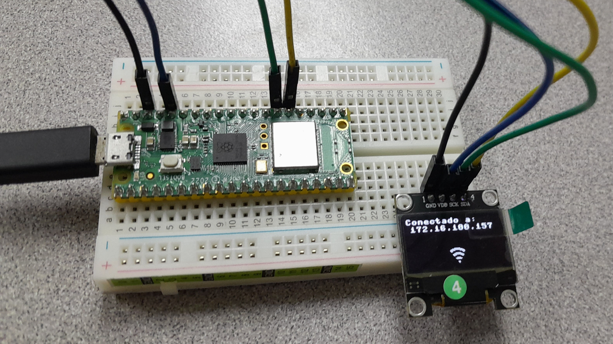
  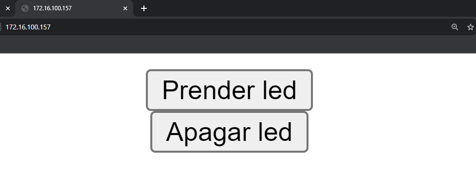
  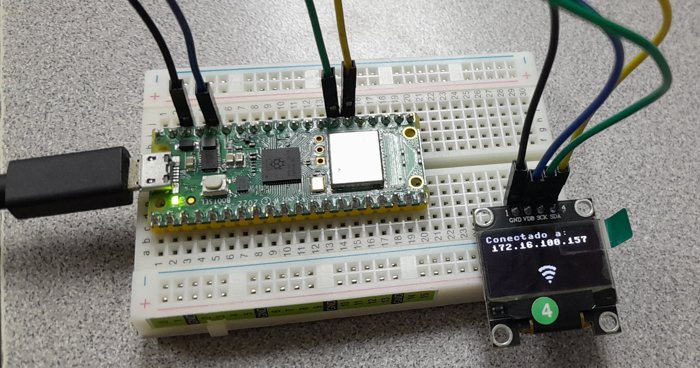
</center>

```python
# Hecho por Abner Ramirez Castaneda
#     con un numero de control de 20211828.
# Carrera de Ing. Sistemas Computacionales.
# Sistemas Programables B por Rene Solis Reyes.

import framebuf
import network
import socket
from time import sleep
from machine import Pin, I2C

miLed = Pin("LED", machine.Pin.OUT)
scrResX = 128
scrResY = 64
loadStep = 1
estaConectado = False
bytesLoad1 = bytearray([
        0x7f, 0xff, 0xe0, 0xff, 0xff, 0xf0, 0xff, 0xff, 0xf0, 0xff, 0xff, 0xf0, 0xff, 0xff, 0xf0, 0xfc,
0x03, 0xf0, 0xf8, 0x01, 0xf0, 0xf8, 0x01, 0xf0, 0xf8, 0x01, 0xf0, 0xf8, 0x01, 0xf0, 0xf8, 0x01,
0xf0, 0xf8, 0x01, 0xf0, 0xf8, 0x01, 0xf0, 0xf8, 0x01, 0xf0, 0xfc, 0x03, 0xf0, 0xff, 0xff, 0xf0,
0xff, 0xff, 0xf0, 0xff, 0xff, 0xf0, 0xff, 0xff, 0xf0, 0x7f, 0xff, 0xe0 ])
bytesLoad2 = bytearray([
        0x7f, 0xff, 0xe0, 0xff, 0xff, 0xf0, 0xff, 0xff, 0xf0, 0xff, 0xff, 0xf0, 0x7f, 0xff, 0xf0, 0x00,
0x03, 0xf0, 0x00, 0x01, 0xf0, 0x00, 0x01, 0xf0, 0x00, 0x01, 0xf0, 0x00, 0x01, 0xf0, 0x00, 0x01,
0xf0, 0x00, 0x01, 0xf0, 0x00, 0x01, 0xf0, 0x00, 0x01, 0xf0, 0x00, 0x03, 0xf0, 0x7f, 0xff, 0xf0,
0xff, 0xff, 0xf0, 0xff, 0xff, 0xf0, 0xff, 0xff, 0xf0, 0x7f, 0xff, 0xe0 ])
bytesLoad3 = bytearray([
        0x7f, 0xff, 0xe0, 0xff, 0xff, 0xf0, 0xff, 0xff, 0xf0, 0xff, 0xff, 0xf0, 0x7f, 0xff, 0xf0, 0x00,
0x03, 0xf0, 0x00, 0x01, 0xf0, 0x00, 0x01, 0xf0, 0x00, 0x01, 0xf0, 0x00, 0x01, 0xf0, 0x00, 0x01,
0xf0, 0x00, 0x01, 0xf0, 0x00, 0x01, 0xf0, 0x00, 0x01, 0xf0, 0x00, 0x03, 0xf0, 0x00, 0x1f, 0xf0,
0x00, 0x3f, 0xf0, 0x00, 0x3f, 0xf0, 0x00, 0x3f, 0xf0, 0x00, 0x1f, 0xe0 ])
bytesLoad4 = bytearray([
        0x7f, 0xff, 0xe0, 0xff, 0xff, 0xf0, 0xff, 0xff, 0xf0, 0xff, 0xff, 0xf0, 0x7f, 0xff, 0xf0, 0x00,
0x03, 0xf0, 0x00, 0x01, 0xf0, 0x00, 0x01, 0xf0, 0x00, 0x01, 0xf0, 0x00, 0x01, 0xf0, 0x00, 0x01,
0xf0, 0x00, 0x01, 0xf0, 0x00, 0x01, 0xf0, 0x00, 0x01, 0xf0, 0x00, 0x00, 0xe0, 0x00, 0x00, 0x00,
0x00, 0x00, 0x00, 0x00, 0x00, 0x00, 0x00, 0x00, 0x00, 0x00, 0x00, 0x00 ])
bytesLoad5 = bytearray([
        0x7f, 0xff, 0xe0, 0xff, 0xff, 0xf0, 0xff, 0xff, 0xf0, 0xff, 0xff, 0xf0, 0x7f, 0xff, 0xe0, 0x00,
0x00, 0x00, 0x00, 0x00, 0x00, 0x00, 0x00, 0x00, 0x00, 0x00, 0x00, 0x00, 0x00, 0x00, 0x00, 0x00,
0x00, 0x00, 0x00, 0x00, 0x00, 0x00, 0x00, 0x00, 0x00, 0x00, 0x00, 0x00, 0x00, 0x00, 0x00, 0x00,
0x00, 0x00, 0x00, 0x00, 0x00, 0x00, 0x00, 0x00, 0x00, 0x00, 0x00, 0x00 ])
bytesLoad6 = bytearray([
        0x7f, 0x80, 0x00, 0xff, 0xc0, 0x00, 0xff, 0xc0, 0x00, 0xff, 0xc0, 0x00, 0x7f, 0x80, 0x00, 0x00,
0x00, 0x00, 0x00, 0x00, 0x00, 0x00, 0x00, 0x00, 0x00, 0x00, 0x00, 0x00, 0x00, 0x00, 0x00, 0x00,
0x00, 0x00, 0x00, 0x00, 0x00, 0x00, 0x00, 0x00, 0x00, 0x00, 0x00, 0x00, 0x00, 0x00, 0x00, 0x00,
0x00, 0x00, 0x00, 0x00, 0x00, 0x00, 0x00, 0x00, 0x00, 0x00, 0x00, 0x00 ])
bytesLoad7 = bytearray([
        0x00, 0x00, 0x00, 0x00, 0x00, 0x00, 0x00, 0x00, 0x00, 0x00, 0x00, 0x00, 0x00, 0x00, 0x00, 0x00, 
0x00, 0x00, 0x00, 0x00, 0x00, 0x00, 0x00, 0x00, 0x00, 0x00, 0x00, 0x00, 0x00, 0x00, 0x00, 0x00, 
0x00, 0x00, 0x00, 0x00, 0x00, 0x00, 0x00, 0x00, 0x00, 0x00, 0x00, 0x00, 0x00, 0x00, 0x00, 0x00, 
0x00, 0x00, 0x00, 0x00, 0x00, 0x00, 0x00, 0x00, 0x00, 0x00, 0x00, 0x00 ])
bytesLoad8 = bytearray([
        0x00, 0x00, 0x00, 0x00, 0x00, 0x00, 0x00, 0x00, 0x00, 0x00, 0x00, 0x00, 0x00, 0x00, 0x00, 0x70,
0x00, 0x00, 0xf8, 0x00, 0x00, 0xf8, 0x00, 0x00, 0xf8, 0x00, 0x00, 0xf8, 0x00, 0x00, 0xf8, 0x00,
0x00, 0xf8, 0x00, 0x00, 0xf8, 0x00, 0x00, 0xf8, 0x00, 0x00, 0x70, 0x00, 0x00, 0x00, 0x00, 0x00,
0x00, 0x00, 0x00, 0x00, 0x00, 0x00, 0x00, 0x00, 0x00, 0x00, 0x00, 0x00 ])
bytesLoad9 = bytearray([
        0x00, 0x00, 0x00, 0x00, 0x00, 0x00, 0x00, 0x00, 0x00, 0x00, 0x00, 0x00, 0x00, 0x00, 0x00, 0x70,
0x00, 0x00, 0xf8, 0x00, 0x00, 0xf8, 0x00, 0x00, 0xf8, 0x00, 0x00, 0xf8, 0x00, 0x00, 0xf8, 0x00,
0x00, 0xf8, 0x00, 0x00, 0xf8, 0x00, 0x00, 0xf8, 0x00, 0x00, 0xf8, 0x00, 0x00, 0xff, 0x80, 0x00,
0xff, 0xc0, 0x00, 0xff, 0xc0, 0x00, 0xff, 0xc0, 0x00, 0x7f, 0x80, 0x00 ])
bytesLoad10 = bytearray([
        0x00, 0x00, 0x00, 0x00, 0x00, 0x00, 0x00, 0x00, 0x00, 0x00, 0x00, 0x00, 0x00, 0x00, 0x00, 0x70,
0x00, 0x00, 0xf8, 0x00, 0x00, 0xf8, 0x00, 0x00, 0xf8, 0x00, 0x00, 0xf8, 0x00, 0x00, 0xf8, 0x00,
0x00, 0xf8, 0x00, 0x00, 0xf8, 0x00, 0x00, 0xf8, 0x00, 0x00, 0xfc, 0x00, 0x00, 0xff, 0xff, 0xe0,
0xff, 0xff, 0xf0, 0xff, 0xff, 0xf0, 0xff, 0xff, 0xf0, 0x7f, 0xff, 0xe0 ])
bytesLoad11 = bytearray([
        0x00, 0x00, 0x00, 0x00, 0x00, 0x00, 0x00, 0x00, 0x00, 0x00, 0x00, 0x00, 0x00, 0x00, 0x00, 0x70,
0x00, 0xe0, 0xf8, 0x01, 0xf0, 0xf8, 0x01, 0xf0, 0xf8, 0x01, 0xf0, 0xf8, 0x01, 0xf0, 0xf8, 0x01,
0xf0, 0xf8, 0x01, 0xf0, 0xf8, 0x01, 0xf0, 0xf8, 0x01, 0xf0, 0xfc, 0x03, 0xf0, 0xff, 0xff, 0xf0,
0xff, 0xff, 0xf0, 0xff, 0xff, 0xf0, 0xff, 0xff, 0xf0, 0x7f, 0xff, 0xe0 ])
bytesLoad12 = bytearray([
        0x00, 0x1f, 0xe0, 0x00, 0x3f, 0xf0, 0x00, 0x3f, 0xf0, 0x00, 0x3f, 0xf0, 0x00, 0x1f, 0xf0, 0x70,
0x01, 0xf0, 0xf8, 0x01, 0xf0, 0xf8, 0x01, 0xf0, 0xf8, 0x01, 0xf0, 0xf8, 0x01, 0xf0, 0xf8, 0x01,
0xf0, 0xf8, 0x01, 0xf0, 0xf8, 0x01, 0xf0, 0xf8, 0x01, 0xf0, 0xfc, 0x03, 0xf0, 0xff, 0xff, 0xf0,
0xff, 0xff, 0xf0, 0xff, 0xff, 0xf0, 0xff, 0xff, 0xf0, 0x7f, 0xff, 0xe0 ])
bytesConexion = bytearray([
        0x03, 0xfc, 0x00, 0x1f, 0xff, 0x80, 0x7f, 0xff, 0xe0, 0xfe, 0x07, 0xf0, 0xf0, 0x00, 0xf0, 0x60, 
0x00, 0x60, 0x01, 0xfc, 0x00, 0x07, 0xff, 0x00, 0x1f, 0xff, 0xc0, 0x1f, 0x07, 0xc0, 0x0c, 0x01, 
0x80, 0x00, 0x00, 0x00, 0x00, 0xf8, 0x00, 0x03, 0xfe, 0x00, 0x01, 0xfc, 0x00, 0x00, 0x00, 0x00, 
0x00, 0x00, 0x00, 0x00, 0x70, 0x00, 0x00, 0x70, 0x00, 0x00, 0x20, 0x00 ])
listBytes = [bytesLoad1, bytesLoad2, bytesLoad3, bytesLoad4, bytesLoad5, bytesLoad6, bytesLoad7, bytesLoad8, bytesLoad9, bytesLoad10, bytesLoad11, bytesLoad12]

def connect():
    miWlan = network.wlan(network.STA_IF)
    miWlan.active(True)
    miWlan.connect('TecNM-ITT-Docentes', 'tecnm2022!')
    while miWlan.isconnected() == False:
        for miBuffer in listBytes:
            if loadStep != len(listBytes):
                loadStep += 1
            else:
                loadStep = 1
            displayImg(oled, miBuffer, 20, 20, int((scrResX - 20) / 2), int((scrResY - 20) / 2))
            sleep(0.05)
        print('Esperando conexion...')
        sleep(1)
    ip = miWlan.ifconfig()[0]
    estaConectado = True
    displayImg(oled, bytesConexion, 20, 20, int((scrResX - 20) / 2), int((scrResY - 20) / 2))
    
    print(f'Conectado a {ip}')
    return ip

def open_socket(ip):
    miDireccion = (ip, 80)
    miConexion = socket.socket()
    miConexion.setsockopt(socket.SOL_SOCKET, socket.SO_REUSEADDR, 1)
    miConexion.bind(miDireccion)
    miConexion.listen(1)
    return miConexion

def webpage():
    html = """
        <!DOCTYPE html>
        <html>
        <body>
        <center>
        <form action="./lighton">
        <input type="submit" value="Prender led" />
        </form>
        <form action="./lightoff">
        <input type="submit" value="Apagar led" />
        </form>
        </center>
        </body>
        </html>
        """
    return str(html)

def serve(miConexion):
    miLed.off()
    while True:
        miCliente = miConexion.accept()[0]
        miPedido = miCliente.recv(1024)
        miPedido = str(miPedido)
        try:
            miPedido = miPedido.split()[1]
        except IndexError:
            pass
        if miPedido == '/lighton?':
            miLed.on()
        elif miPedido =='/lightoff?':
            miLed.off()
        html = webpage()
        miCliente.send(html)
        miCliente.close()

def displayImg(oled, myBytes, bytesX, bytesY, posX, posY):
    miFrameB = framebuf.FrameBuffer(myBytes, bytesX, bytesY, framebuf.MONO_HLSB)
    oled.blit(miFrameB, posX, posY)
    oled.show()

if __name__ == '__main__':
    try:
        ip = connect()
        miConexion = open_socket(ip)
        serve(miConexion)
    except KeyboardInterrupt:
        miConexion.close()
    i2c = I2C(0, scl=Pin(21), sda=Pin(20), freq=200000)
    oled = SSD1306_I2C(scrResX, scrResY, i2c)
```

# Bluetooth
<center>
  
</center>

```python
# Hecho por Abner Ramirez Castaneda
#     con un numero de control de 20211828.
# Carrera de Ing. Sistemas Computacionales.
# Sistemas Programables B por Rene Solis Reyes.

from machine import Pin 
from time import sleep
import bluetooth
from ble_simple_peripheral import BLESimplePeripheral

ble = bluetooth.BLE()
sp = BLESimplePeripheral(ble)
led = Pin("LED", Pin.OUT)

morseStatus = 0

def on_rx(data):
    print("Data received: ", data)
    global morseStatus
    if data == b'sos\r\n':
        if morseStatus == 0:
            morseStatus = 1
            doDot()
            doDot()
            doDot()
            doDah()
            doDah()
            doDah()
            doDot()
            doDot()
            doDot()
            sleep(1)
            morseStatus = 0
            
def doDot():
    led.value(True)
    sleep(0.1)
    led.value(False)
    sleep(0.1)
    
def doDah():
    led.value(True)
    sleep(0.5)
    led.value(False)
    sleep(0.1)

while True:
    if sp.is_connected():
        sp.on_write(on_rx)
```
