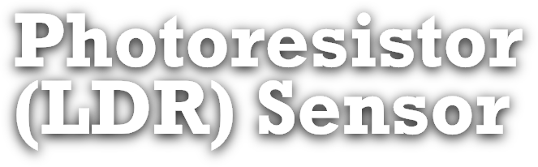
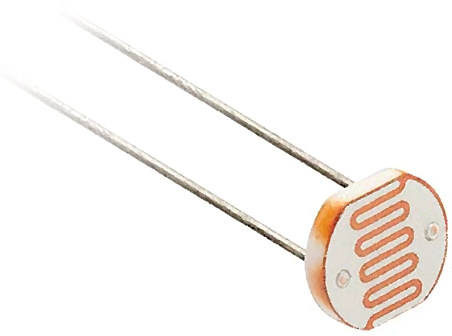
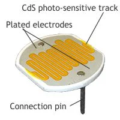
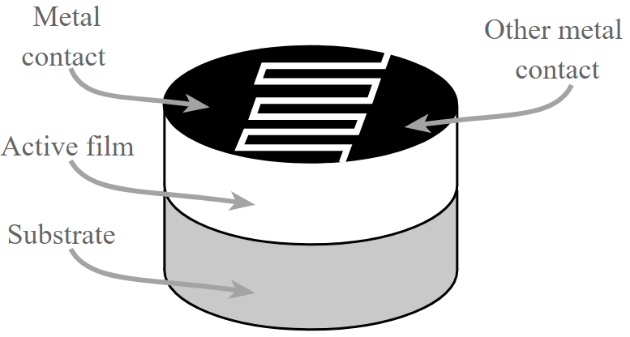
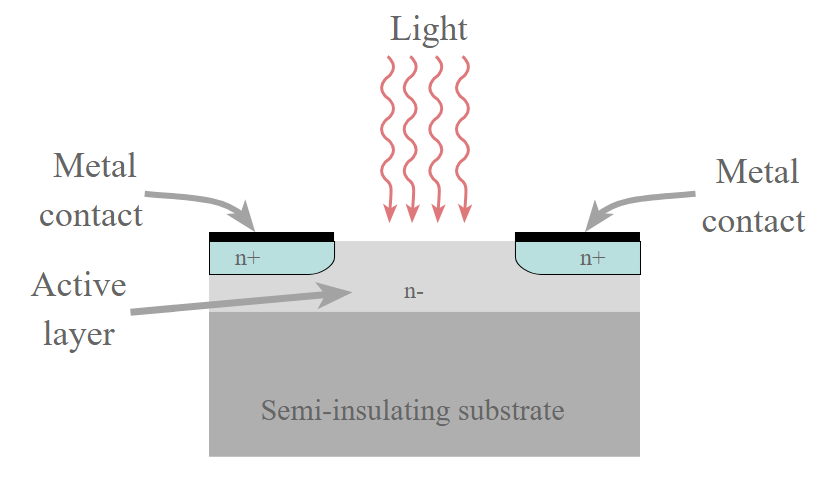
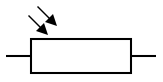
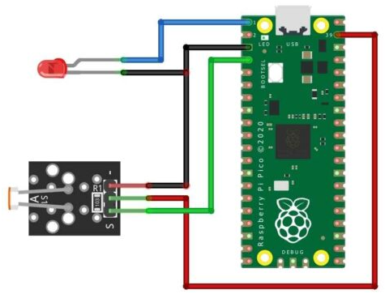

**Tecnológico​ ​Nacional​ ​de​ ​México Instituto Tecnológico de Tijuana**

***Departamento de Sistemas y Computación - Ingeniería en Sistemas Computacionales***

Sistemas Programables

  > Rene Solis Reyes

Abner Ramírez Castañeda

  > No. de control: 20211828

# Presentación

<center>
  
  <div>
    <h1>Descripción</h1>
    <p align="justify">
      El Photoresistor es un componente electrónico dependiente de la luz, esto significa que detecta y mide la intensidad de la luz que atrapa por medio de su sensor, con esta entrada puede manejar las operaciones del circuito al que está conectado.
    </p>
  
    <h1>Como se Componente</h1>
    <p align="justify">
      El Resistor Dependiente de la Luz es creado de materiales semiconductores para dejar al componente tener propiedades de sensibilidad a la luz; normalmente se han usado materiales como el sulfuro de cadmio “CdSe”, sulfuro de plomo “PbS” o antimoniuro de indio “InSb”.
    </p>
  
    <p align="justify">
      Para fabricar un LDR de sulfuro de cadmio, se mezclan polvo de sulfuro de cadmio altamente purificado y materiales aglutinantes inertes. Luego esta mezcla se prensa y sinteriza. Los electrodos se evaporan al vacío sobre la superficie de un lado para formar peines entrelazados y se conectan los cables de conexión. Luego, el disco se monta en una envoltura de vidrio o se encapsula en plástico transparente para evitar la contaminación de la superficie. La curva de respuesta espectral del sulfuro de cadmio coincide con la del ojo humano. La longitud de onda de máxima sensibilidad es de aproximadamente 560-600 nm, que se encuentra en la parte visible del espectro. Cabe señalar que los dispositivos que contienen plomo o cadmio no cumplen con RoHS y su uso está prohibido en países que cumplen con las leyes RoHS.
    </p>
  
    <h1>Cómo Funciona</h1>
    <p align="justify">
      Cuando la luz es atrapada por el material semiconductor, los fotones de luz son absorbidos por la red del semiconductor y parte de su energía se transfiere a los electrones.
    </p>
  
    <p align="justify">
      La cantidad de energía transferida a los electrones les da a algunos de ellos suficiente energía para liberarse de la red cristalina y luego poder conducir electricidad. Esto da como resultado una reducción de la resistencia del semiconductor y, por tanto, de la resistencia global del LDR. El proceso es progresivo y, a medida que más luz incide sobre el semiconductor LDR, se liberan más electrones para conducir la electricidad y la resistencia cae aún más.
    </p>
    <h1>Tipos de Photoresistores</h1>
  </div>
</center>

- Fotorresistores intrínsecos.
- Fotorresistores extrínsecos.
    
<center>
  <div>
    <p align="justify">
      Fotorresistores intrínsecos: los fotorresistores intrínsecos utilizan materiales semiconductores no dopados, incluidos silicio o germanio. Los fotones que caen sobre el LDR excitan a los electrones moviéndose desde la banda de valencia a la banda de conducción. Como resultado, estos electrones quedan libres para conducir electricidad. Cuanta más luz incide sobre el dispositivo, más electrones se liberan y mayor es el nivel de conductividad, y esto se traduce en un menor nivel de resistencia.
    </p>
    <p align="justify">
      Fotorresistores extrínsecos: los fotorresistores extrínsecos se fabrican a partir de semiconductores de materiales dopados con impurezas. Estas impurezas o dopantes crean una nueva banda de energía por encima de la banda de valencia existente. Como resultado, los electrones necesitan menos energía para transferirse a la banda de conducción debido a la menor brecha de energía.
    </p>
  </div>
</center>

|                                 Fotorresistores intrínsecos                                 |                                  Fotorresistores extrínsecos                                 |
|:-------------------------------------------------------------------------------------------:|:--------------------------------------------------------------------------------------------:|
| Utilizan materiales semiconductores no dopados                                              | Utilizan materiales semiconductores dopados                                                  |
| Cuanta más luz, más electrones se liberan, mayor conductividad y menor nivel de resistencia | Los electrones necesitan menos energía para transferirse debido a la menor brecha de energía |

<center>
  <div>
    <h1>Símbolo del Photoresistor</h1>
    <p align="justify">
      En base al estándar IEC el símbolo dentro de un circuito tiene forma de un rectángulo con una entrada y una salida, y dos punteros apuntando hacia abajo. Algunas veces puede que se encuentre plasmado el símbolo con un círculo rodeandolo.
    </p>
  
    <h1>Ejemplo de su uso</h1>
    <p align="justify">
      Dentro de la página de Wokwi, se agregan los componentes de un PicoW, el sensor del photoresistor y un LED para visualizar si recibe suficiente luz o no. El PicoW es programado dentro del simulador para realizar las acciones dependiendo de las opciones de los componentes.
    </p>
  
  </div>
</center>

# Código

```python
from machine import Pin
import time
 
led = Pin(0, Pin.OUT)
ldr = Pin(2, Pin.IN, Pin.PULL_DOWN)
 
while True:
    if ldr.value():
        led.value(1)
        time.sleep(0.5)
    else:
        led.value(0)
        time.sleep(0.5)
```
<center>
  <div>
    <p align="justify">
      Se importa el Pin y la librería del tiempo, se asignan los pines y luego se asigna la activación del led dependiendo del valor del sensor, prendiendolo al no detectar suficiente luz, y apagandola al obtener suficiente.
    </p>
  </div>
</center>

