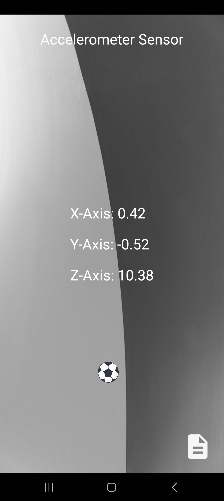
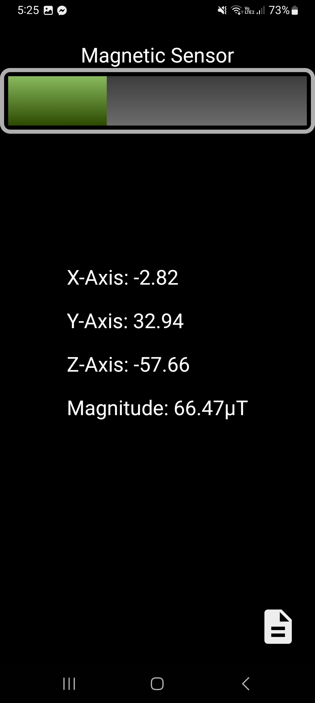
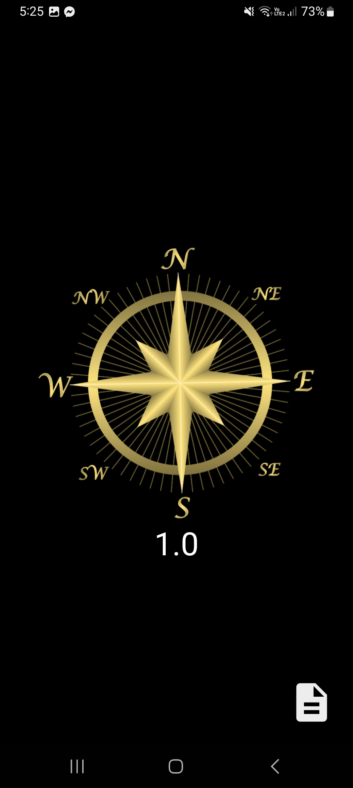
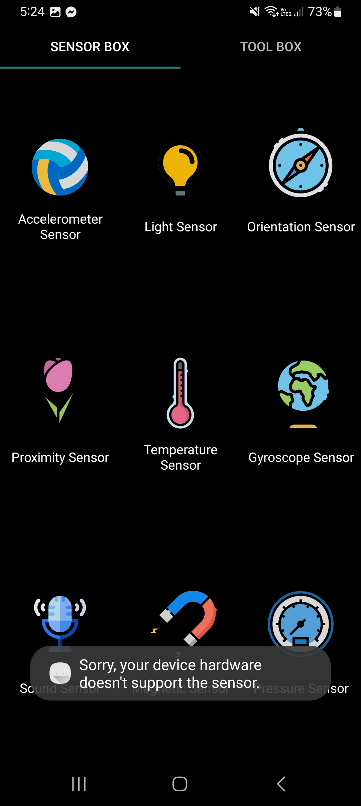

**Tecnológico​ ​Nacional​ ​de​ ​México Instituto Tecnológico de Tijuana**

***Departamento de Sistemas y Computación - Ingeniería en Sistemas Computacionales***

Sistemas Programables

  > Rene Solis Reyes

Abner Ramírez Castañeda

  > No. de control: 20211828

# 1.4  ¿Qué sensores tiene su smartphone vía APP?

| Nombre                 | Icono | Descripción                                                                                                                                                                                                                                                                                                                                                                                                                                                                                                                                                           | Samsung A13   |
|------------------------|-------|-----------------------------------------------------------------------------------------------------------------------------------------------------------------------------------------------------------------------------------------------------------------------------------------------------------------------------------------------------------------------------------------------------------------------------------------------------------------------------------------------------------------------------------------------------------------------|---------------|
| Sensor de aceleración  || El acelerómetro del móvil consta de una parte móvil que se mueve dependiendo de la aceleración que le apliques, y de otra fija que interpreta el voltaje resultante de este movimiento para determinar la velocidad a la que lo hace y su orientación. En este apartado de la aplicación descargada, se tiene una bola de fútbol que simula su movimiento dependiendo de la gravedad o aceleración aplicada desplegando sus ejes.                                                                                                                                     | Disponible    |
| Sensor magnético       || Se trata de un componente electrónico capaz de medir y cuantificar la cantidad de fuerza magnética de un objeto. En este apartado de la aplicación descargada, se puede acercar el celular a fuentes magnéticas para observar la barra cambiar de valor dependiendo de cuanto detecte al momento.                                                                                                                                                                                                                                                                     | Disponible    |
| Sensor de orientación  || Mide y cuantifica las fuerzas magnéticas. Suele utilizarse como brújula electrónica configurándose para detectar el polo norte magnético de la tierra, y así definir dónde está el polo geográfico. En este apartado de la aplicación puede observarse una brújula apuntando hacia el norte, sur, este y oeste moviéndose dinámicamente mientras se mueve el celular.                                                                                                                                                                                                 | Disponible    |
| Sensor de aproximación || Es el encargado de permitirle al móvil saber, por ejemplo, cuándo nos acercamos el móvil a la cara para que este pueda apagar la pantalla. Está compuesto por un LED infrarrojo que emite un rayo invisible al ojo humano, y un receptor de infrarrojos que detecta la vuelta del rayo cuando rebota con una superficie. El smartphone Samsung A13 genera la unidad virtual por ProTos Lite (Sensor de proximidad Lite Samsung Ear Hover) usando una combinación de datos de la orientación del smartphone y la cámara pero no realiza el cálculo de proximidad real. | Disponible    |
| Sensor giroscopio      || Sensor que mide la aceleración no gravitacional, y que está destinado a complementar la información sobre la orientación del móvil que ofrece el acelerómetro. Para eso, añade una cuarta dimensión de movimiento que mide la rotación o el giro del móvil. En el caso del smartphone Samsung A13, no está disponible.                                                                                                                                                                                                                                                | No disponible |
| Sensor de luz          || La función de un sensor de luz es detectar la intensidad de la luz del ambiente para por ejemplo, poder ajustar el nivel de brillo de la pantalla del terminal. Este ajuste lo realizará de forma totalmente automática. En el caso del smartphone Samsung A13, no está disponible.                                                                                                                                                                                                                                                                                   | No disponible |
| Sensor de temperatura  || Muchas veces puede aparecernos el clásico mensaje de que nuestro smartphone se encuentra a una temperatura más alta de la recomendable. Lo sabe gracias a que dentro suyo posee un termómetro que le informa de la temperatura del núcleo del equipo. La idea es que el dispositivo no sufra daños de ningún tipo. En el caso del smartphone Samsung A13, no está disponible.                                                                                                                                                                                         | No disponible |
| Sensor de sonido       || El sensor de sonido es un módulo que convierte las ondas acústicas en señales eléctricas. Los detectores de sonido funcionan en base a los cambios de capacitancia causados por la vibración de las ondas sonoras. En el caso del smartphone Samsung A13, se crasheó al intentar abrirlo.                                                                                                                                                                                                                                                                             | No disponible |
| Sensor de presión      || Se realiza la lectura de la presión atmosférica directamente desde el smartphone. En el caso del smartphone Samsung A13, no está disponible.                                                                                                                                                                                                                                                                                                                                                                                                                          | No disponible |

  

    <h1>Samsung A13</h1>
    
    

      Al probar la aplicación de Sensor Box por Nirmal Labs en el smartphone Samsung A13, se realizó la prueba de los diferentes sensores desplegados en la interfaz de la aplicación para determinar si están disponibles por el hardware y cómo funcionan.
    

  

| Sensor                                                            | Captura de resultados |
|:-------------------------------------------------------------------:|:-----------------------:|
|  Sensor de aceleración                                              ||
|  Sensor magnético                                                   ||
|  Sensor de orientación                                              ||
|  Sensor de aproximación                                             ||
|  Sensor giroscopio,
de luz, de temperatura,
de sonido y de presión  ||
